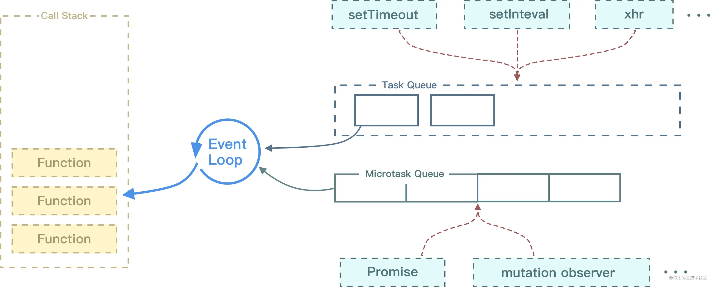
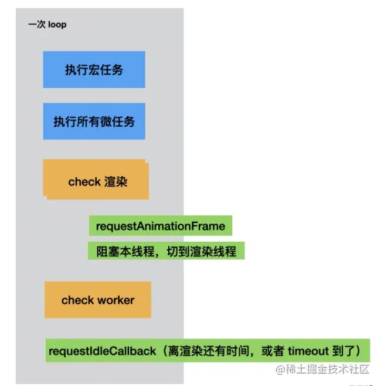

# 浏览器事件机制

## 1. 事件是什么？事件模型？


事件是用户操作网页时发生的交互动作，比如 click/move， 事件除了用户触发的动作外，还可以是文档加载，窗口滚动和大小调整。事件被封装成一个 event 对象，包含了该事件发生时的所有相关信息（ event 的属性）以及可以对事件进行的操作（ event 的方法）。

事件是用户操作网页时发生的交互动作或者网页本身的一些操作，现代浏览器一共有三种事件模型：

- DOM0 级事件模型

> 这种模型不会传播，所以没有事件流的概念，但是现在有的浏览器支持以冒泡的方式实现，它可以在网页中直接定义监听函数，也可以通过 js 属性来指定监听函数。所有浏览器都兼容这种方式。直接在dom对象上注册事件名称，就是DOM0写法。

- IE 事件模型

> 在该事件模型中，一次事件共有两个过程，事件处理阶段和事件冒泡阶段。事件处理阶段会首先执行目标元素绑定的监听事件。然后是事件冒泡阶段，冒泡指的是事件从目标元素冒泡到 document，依次检查经过的节点是否绑定了事件监听函数，如果有则执行。这种模型通过attachEvent 来添加监听函数，可以添加多个监听函数，会按顺序依次执行。

- DOM2 级事件模型

> 在该事件模型中，一次事件共有三个过程，第一个过程是事件捕获阶段。捕获指的是事件从 document 一直向下传播到目标元素，依次检查经过的节点是否绑定了事件监听函数，如果有则执行。后面两个阶段和 IE 事件模型的两个阶段相同。这种事件模型，事件绑定的函数是addEventListener，其中第三个参数可以指定事件是否在捕获阶段执行。


## 2. 如何阻止事件冒泡

- 普通浏览器使用：event.stopPropagation()
- IE浏览器使用：event.cancelBubble = true;

## 3. 对事件委托的理解

### （1）事件委托的概念

事件委托本质上是利用了**浏览器事件冒泡**的机制。因为事件在冒泡过程中会上传到父节点，父节点可以通过事件对象获取到目标节点，因此可以把子节点的监听函数定义在父节点上，由父节点的监听函数统一处理多个子元素的事件，这种方式称为事件委托（事件代理）。

使用事件委托可以不必要为每一个子元素都绑定一个监听事件，这样减少了内存上的消耗。并且使用事件代理还可以实现事件的动态绑定，比如说新增了一个子节点，并不需要单独地为它添加一个监听事件，它绑定的事件会交给父元素中的监听函数来处理。

### （2）事件委托的特点

- 减少内存消耗

> 绑定事件减少，内存占用减少

- 动态绑定事件

> 内部区域对应的事件，可以随意获取，进行分类操作。
### （3）局限性

当然，事件委托也是有局限的。比如 **focus、blur** 之类的事件没有事件冒泡机制，所以无法实现事件委托；**mousemove、mouseout** 这样的事件，虽然有事件冒泡，但是只能不断通过位置去计算定位，对性能消耗高，因此也是不适合于事件委托的。

当然事件委托不是只有优点，它也是有**缺点**的，事件委托会影响页面性能，主要影响因素有：

- 元素中，绑定事件委托的次数；
- 点击的最底层元素，到绑定事件元素之间的**DOM层数**；

在必须使用事件委托的地方，可以进行如下的处理：

- 只在必须的地方，使用事件委托，比如：**ajax的局部刷新区域**
- 尽量的减少绑定的层级，不在**body元素**上，进行绑定
- 减少绑定的次数，如果可以，那么把多个事件的绑定，合并到一次事件委托中去，由这个事件委托的回调，来进行分发。

## 4. 事件委托的使用场景

如：监听页面所有a标签，以此达到监控统计

```javascript
document.addEventListener("click", function(e) {
	if (e.target.nodeName == "A")
		console.log("a");
}, false);
```

但是这些a标签可能包含一些像span、img等元素，如果点击到了这些a标签中的元素，就不会触发click事件，因为事件绑定上在a标签元素上，而触发这些内部的元素时，e.target指向的是触发click事件的元素（span、img等其他元素）。

这种情况下就可以使用事件委托来处理，将事件绑定在a标签的内部元素上，当点击它的时候，就会逐级向上查找，知道找到a标签为止，代码如下：

```javascript
document.addEventListener("click", function(e) {
	var node = e.target;
	while (node.parentNode.nodeName != "BODY") {
		if (node.nodeName == "A") {
			console.log("a");
			break;
		}
		node = node.parentNode;
	}
}, false);
```
## 5. 同步和异步的区别

- **同步**指的是当一个进程在执行某个请求时，如果这个请求需要等待一段时间才能返回，那么这个进程会一直等待下去，直到消息返回为止再继续向下执行。
- **异步**指的是当一个进程在执行某个请求时，如果这个请求需要等待一段时间才能返回，这个时候进程会继续往下执行，不会阻塞等待消息的返回，当消息返回时系统再通知进程进行处理。

## 6. 对事件循环的理解

因为 js 是单线程运行的，在代码执行时，通过将不同函数的执行上下文压入执行栈中来保证代码的有序执行。在执行同步代码时，如果遇到异步事件，js 引擎并不会一直等待其返回结果，而是会将这个事件挂起，继续执行执行栈中的其他任务。当异步事件执行完毕后，再将异步事件对应的回调加入到一个任务队列中等待执行。任务队列可以分为宏任务队列和微任务队列，当当前执行栈中的事件执行完毕后，js 引擎首先会判断微任务队列中是否有任务可以执行，如果有就将微任务队首的事件压入栈中执行。当微任务队列中的任务都执行完成后再去执行宏任务队列中的任务。





Event Loop 执行顺序如下所示：
- 首先执行同步代码，这属于宏任务
- 当执行完所有同步代码后，执行栈为空，查询是否有异步代码需要执行
- 执行所有微任务
- 当执行完所有微任务后，如有必要会渲染页面
- 然后开始下一轮 Event Loop，执行宏任务中的异步代码

## 7. 宏任务和微任务分别有哪些
### 微任务包括：

- promise 的回调
- node 中的 process.nextTick 
- 对 Dom 变化监听的 MutationObserver。

#### 宏任务包括：

- script 脚本的执行
- setTimeout, setInterval, setImmediate 一类的定时事件，
- 还有如 I/O 操作
- UI 渲染等。

## 8. 什么是执行栈

## 9. Node 中的 Event Loop 和浏览器中的有什么区别？process.nextTick 执行顺序？

## 10. 事件触发的过程是怎样的
