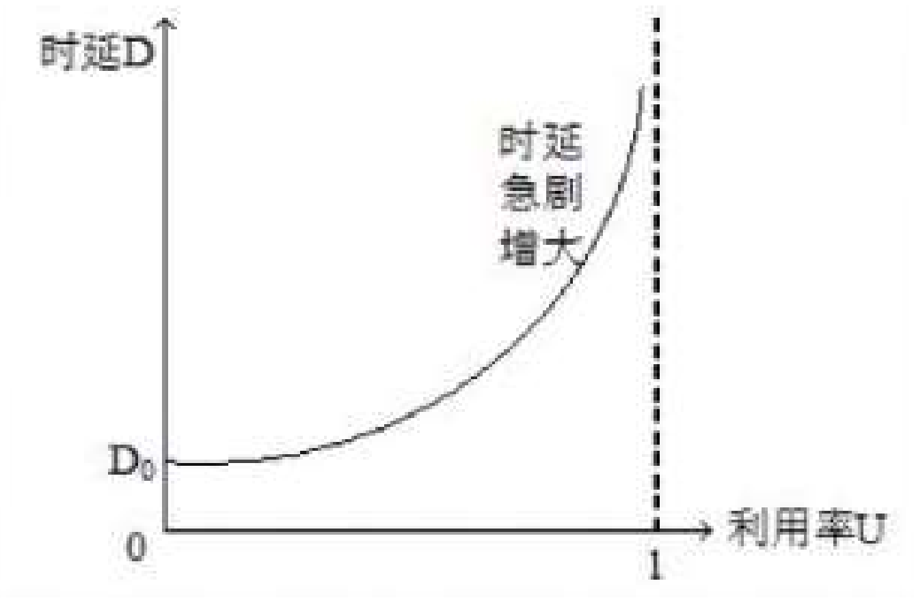
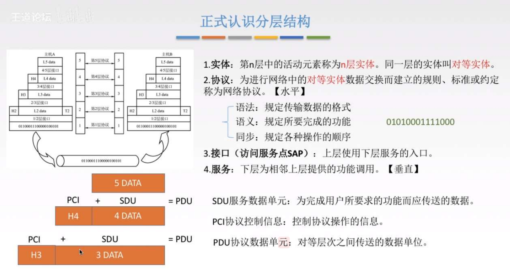
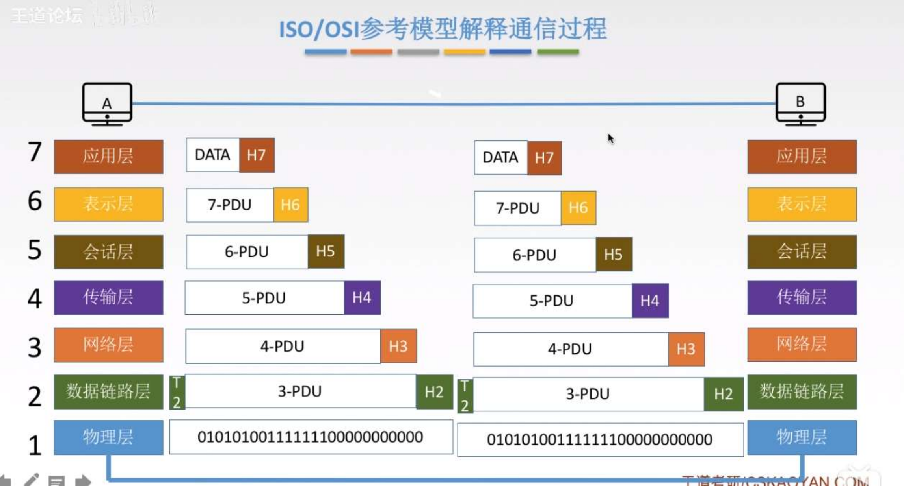
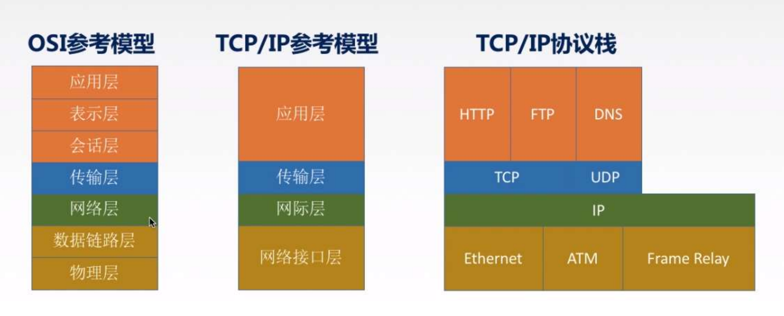
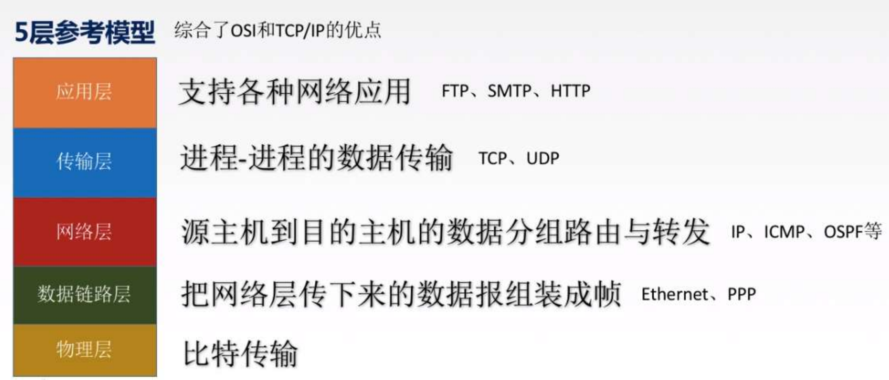
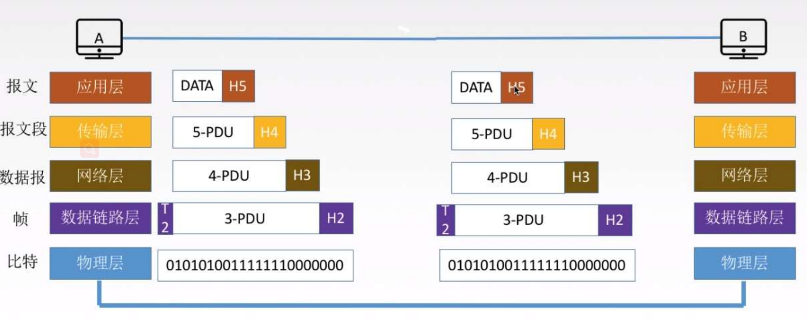

# 1.概述

## 1. 速率相关性能指标

### 1.1 速率

定义：连接在计算机网络上的主机在数字信道上传送数据位数的速率  
单位： b/s, Kb/s, Mb/s, Tb/s   
如果用字节表示，则是B/s, KB/s, MB/s, TB/s   
1Byte=8bit

### 1.2 带宽

在计算机网络中，指的是网络设备所支持的最高速度，单位同速率;  
**是理想条件下最高速率**

### 1.3 吞吐量

指的是单位时间内通过某个网络的数据总量

## 2. 时延相关指标

### 2.1 时延
   
时延包括4大类
   
   | 名称   | 描述                 | 计算公式              |
   | ---- | ------------------ | ----------------- |
   | 发送时延 | 数据从主机到信道上所用的时间     | 发送的数据长度/发送速率      |
   | 传播时延 | 数据在信道上传播所花费的时间     | 信道长度/电磁波在信道上传播的速率 |
   | 排队时延 | 数据在路由器前等待前面数据处理的时间 | -                 |
   | 处理时延 | 数据在路由器中处理需求的时间     | -                 |
   
   使用高速链路（提高网速），只能减少发送时延，无法减少其他三个时延

### 2.2 时延带宽积

公式：时延带宽积=传播时延x带宽
  
意思是链路上又多少比特的数据

### 2.3 往返时延RTT

发送端发送数据开始，到发送端收到来自接收端的确认（接收端收到数据后便立即发送确认），总共经历时延

> RTT=传播时延x2+处理时间（有时可以直接忽略）

### 2.4 利用率

#### 2.4.1 信道利用率
   
> 信道利用率=有数据通过的时间/（有+无）数据通过的时间

#### 2.4.2 网络利用率
   
> 网络利用率=所有信道利用率加权求平均值

#### 2.4.3 时延和利用率的关系图
      

## 3. 分层结构

### 3.1 为什么要分层，分层要做什么
   
1. 发起通信的计算机必须将数据通信的通路进行激活
   
2. 要告诉网络如何识别目的主机
   
3. 发起通信的计算机要查明目的主机是否开机，并且于网络连接正常
   
4. 发起通信的计算机要弄清楚，对方计算机中文件管理程序是否已经做好准备工作
   
5. 确保差错和意外可以解决

### 3.2 正式认识分层结构

## 4. 参考模型

| 名称    | 英文                 | 作用                                                   |
| ----- | ------------------ | ---------------------------------------------------- |
| 应用层   | Application Layer  | 直接为用户的应用进程（例如电子邮件、文件传输和终端仿真）提供服务。如HTTP、SMTP、FTP、DNS等 |
| 表示层   | Presentation Layer | 把数据转换为能与接收者的系统格式兼容并适合传输的格式，即让两个系统可以交换信息              |
| 会话层   | Session Layer      | 负责在数据传输中设置和维护计算机网络中两台计算机之间的通信连接                      |
| 传输层   | Transport Layer    | 负责端到端通讯，可靠传输，不可靠传输，流量控制，复用分用                         |
| 网络层   | Network Layer      | 负责选择路由最佳路径，规划IP地址（ipv4和ipv6变化只会影响网络层），拥塞控制           |
| 数据链路层 | Data Link Layer    | 帧的开始和结束，还有透明传输，差错校验（纠错由传输层解决）                        |
| 物理层   | Physical Layer     | 定义网络设备接口标准，电器标准（电压），如何在物理链路上传输的更快                    |

### 4.1 OSI流程简介

网络层及以上，每一层都要对上一层发送的数据进行处理（加个头部）

数据链路层不仅要加头部，还需要加尾部

物理层什么都不加，只管发送数据（比特流）

   

### 4.2 TCP/IP参考模型
   

### 4.3 五层参考模型及其传输过程简介
   
   

