# 2.物理层（Physical Layer）

基本概念

> 电脑要组网，第一件事要干什么？当然是先把电脑连起来，可以用光缆、电缆、双绞线、无线电波等方式。
> 
> 这就叫做”实体层”，逼格高一点的叫法就是物理层。它就是把电脑连接起来的物理手段。它主要规定了网络的一些电气特性，作用是负责传送0和1的电信号。
> 
> 至于0和1的信号是什么，还轮不到物理层还决定。

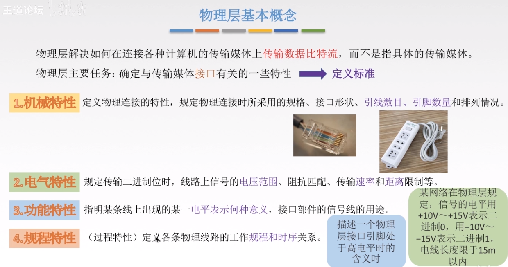

数据通信基本知识

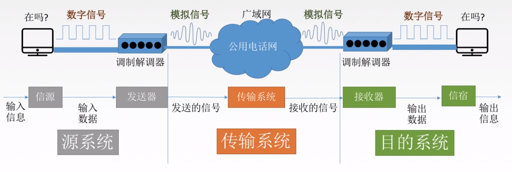
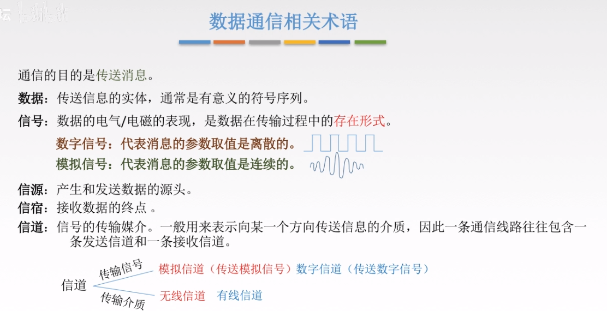

三种通讯方式

| 名称    | 英文          | 定义                   | 需要信道条数 |
| ----- | ----------- | -------------------- | ------ |
| 单工通信  | simplex     | 只能一个发一个收             | 一条     |
| 半双工通信 | half-duplex | 都可以发或者收，但是同一时间只能进行一个 | 两条     |
| 全双工通信 | duplex      | 都可以同时收发数据            | 两条     |

两种数据传输方式

| 传输方式 | 特点           |
| ---- | ------------ |
| 串行数据 | 速度慢，省钱，适合远距离 |
| 并行传输 | 速度快，耗钱，适合近距离 |

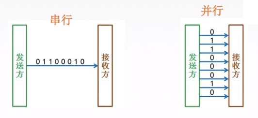

码元（Symbol）  

> 定义：码元是指用一个固定时长的信号波形（数字脉冲），代表离散数值的基本波形。当有多个离散状态时，成为M进制码元
> 
> 一个码元可以携带多个比特的信息
> 
> 个人理解：码元就是在网线上传输的一个个信号段。码元的不同进制就是用来表示不同的数值的

波特（Baud）

用来指一秒可以传输多少个码元

速率

分为码元传输速率和信息传输速率

信息传输速率是b/s，就是我们常说的网速

码元可以理解为几个比特的集合，所以信息传输速率（网速）=码元传输速率x码元所带信息量（多少比特）

码元所带信息（比特数）= log2（码元进制数）

带宽（Band Width）

用来表示最高数据速率

奈式准则（Nyquist）

> 是在理想状态下得出的结论

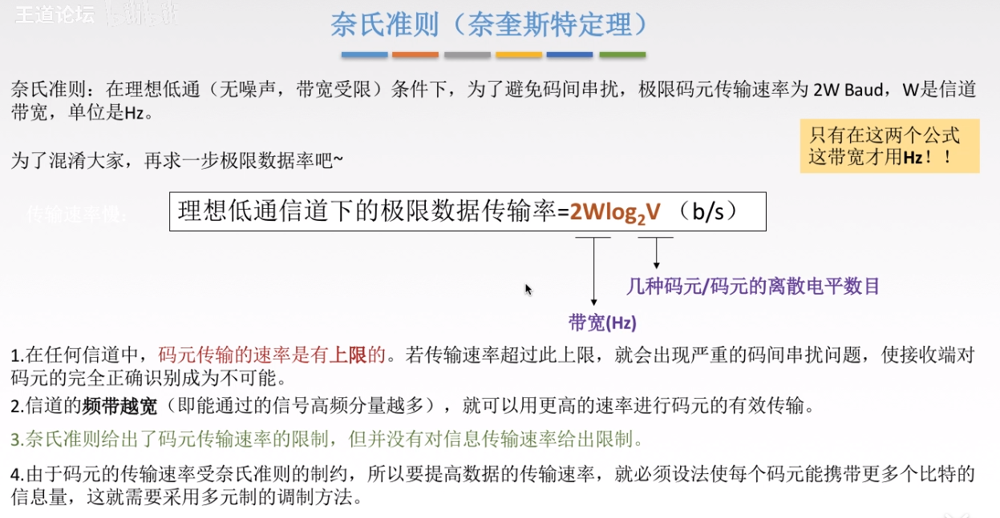

香农公式（Shannon）

> 是在有噪声的信道中得出的结论

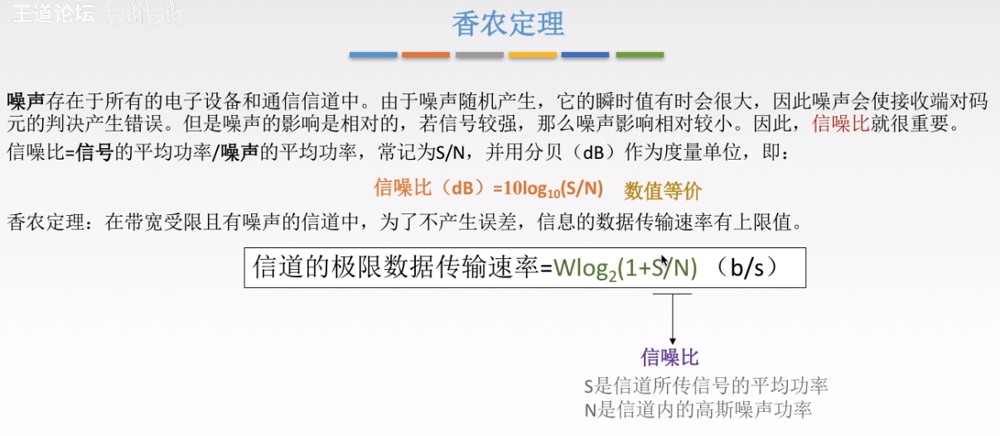
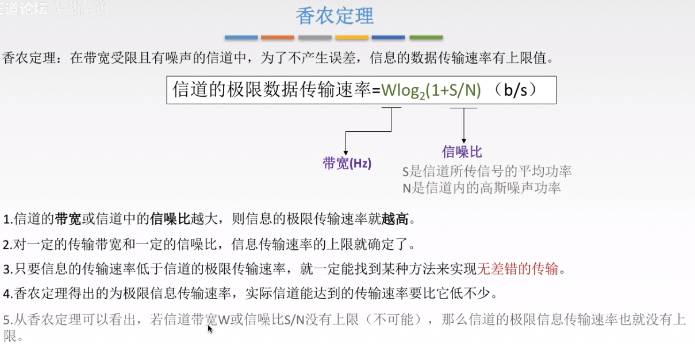

基带信号和宽带/带通信号（Base band，pass band）

> 计算机网络中用的基带信号是数字信号

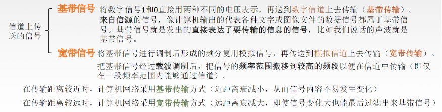

编码

> 将数据转化为数字信号
> 
> 数字数据(digtal data)通过 数字发送器(digit emitter) 转化为 数字信号(digtal signal)

模拟数据(analog data)通过 PCM编码器(PCM coder) 转化为 数字信号 (digtal signal)

> 单极性不归零编码：只使用一个电压值，高电平表示1，低电平表示0.
> 
> 双极性不归零编码：用幅值相等的正负电平表示二进制数1和0.
> 
> 单极性归零编码：发送码1时高电平在整个码元期间只持续一段时间，其余时间返回零电平。
> 
> 双极性归零编码：正负零三个电平，信号本身携带同步信息。

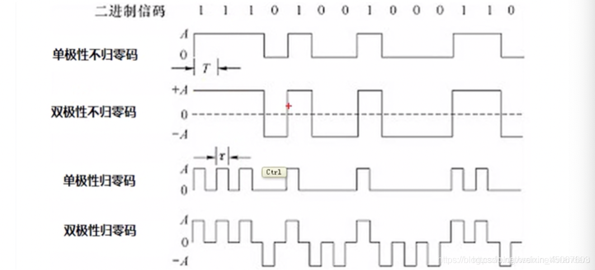

> 曼彻斯特编码：单极性编码的缺点是没有办法区分此时是没有信号，还是有信号，但是信号是0.
> 这种编码方式是bit中间有信号，低-高跳转表示0，高-低跳转表示1，一个时钟周期只可以表示一个bit，并且必须通过两次采样才能得到一个bit。它能携带时钟信号，而且能区分此时是没有信号还是信号为0.
> 
> 差分曼彻斯特编码：抗干扰能力比曼彻斯特编码更强。bit与bit之间有信号跳变，表示下一个bit为0，bit与bit之间没有信号跳变，表示下一个bit为1。

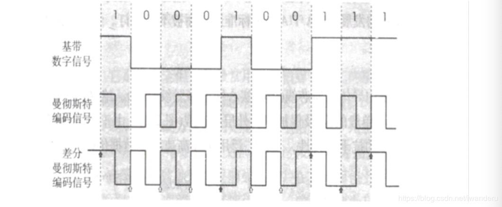

调制：数据转化为模拟信号（了解）

物理层传输介质

常见的导向性传输介质

双绞线

> 根据有无屏蔽层分为屏蔽双绞线（STP）和无屏蔽双绞线（UTP）   

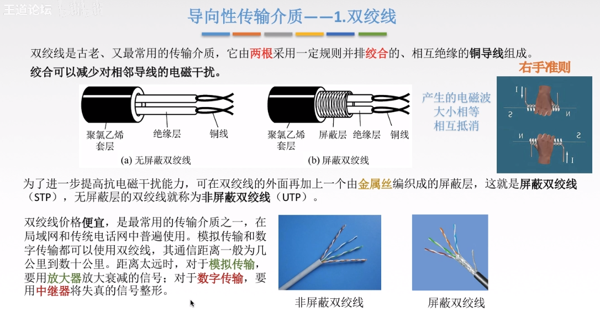

同轴电缆（Coaxial Cable）
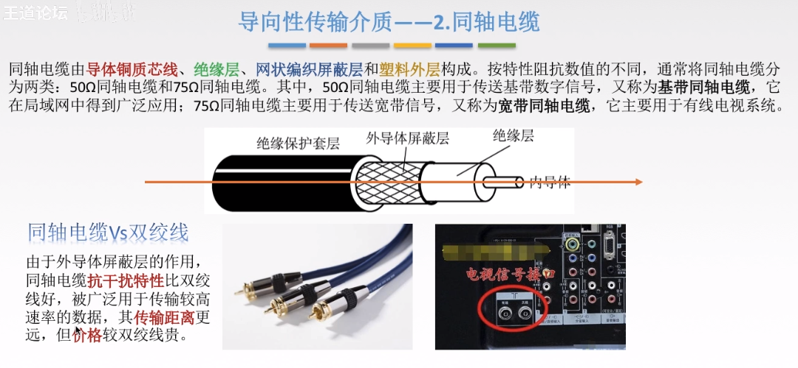

光纤（Optical fiber）
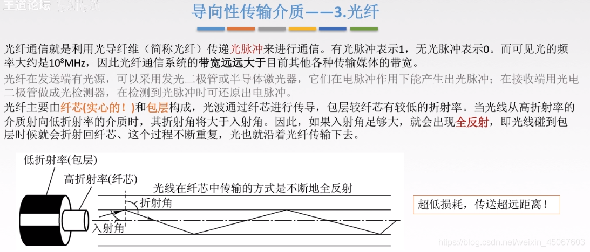
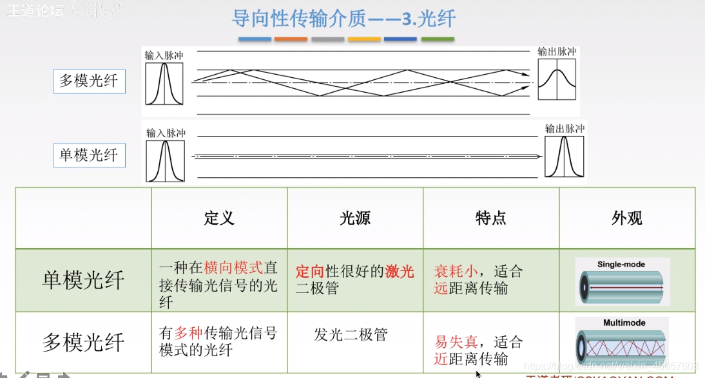

常见的非导向性传输介质

> 包括无线电波，微波，红外线和激光等

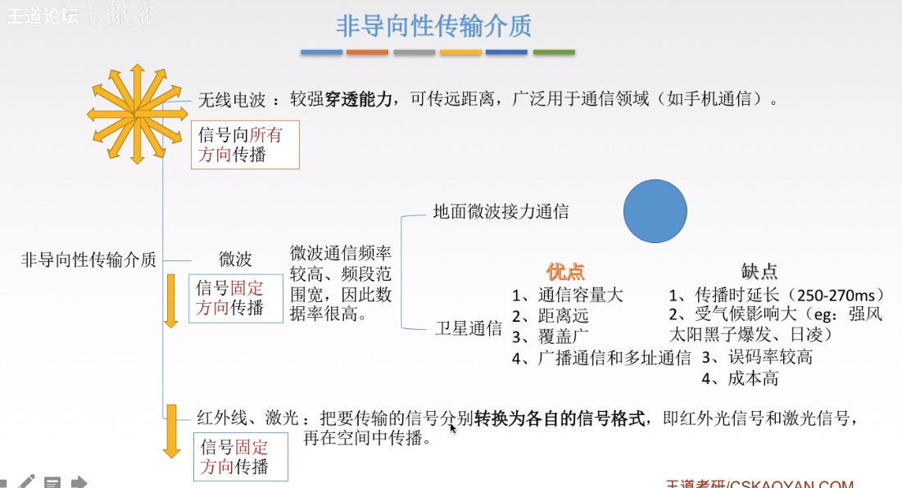

物理层设备
中继器（RP repeater）
注释：5-4-3规则是为了限制中继器使用次数的，理由可见图
5是指不能超过5个网段
4是指在这些网段中的物理层网络设备（中继器，集线器）最多不超过4个
3是指这些网段中最多只有三个网段挂有计算机
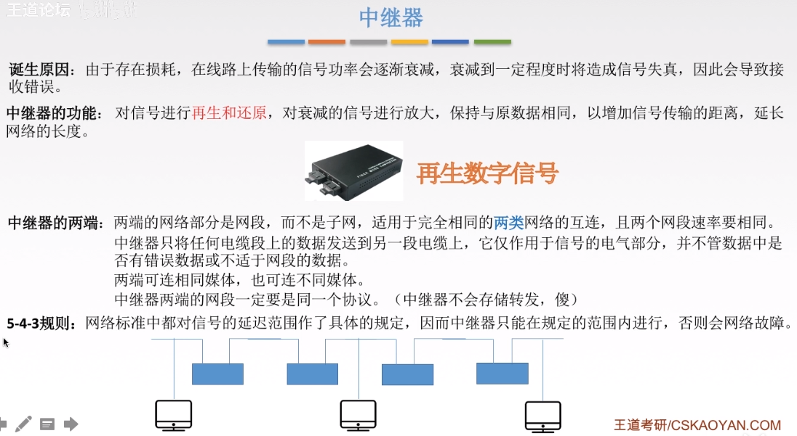

集线器（Hub）

> 集线器是个大的冲突域，同时只能有两个设备进行通讯，只会传输信号，没有智能。
> 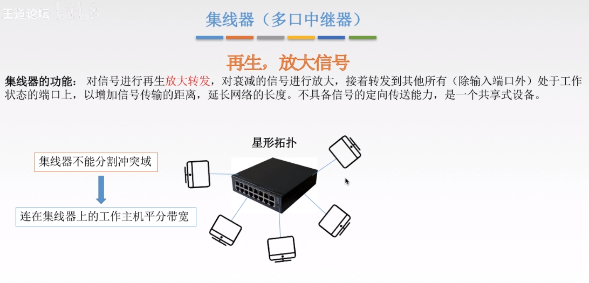

本章总结
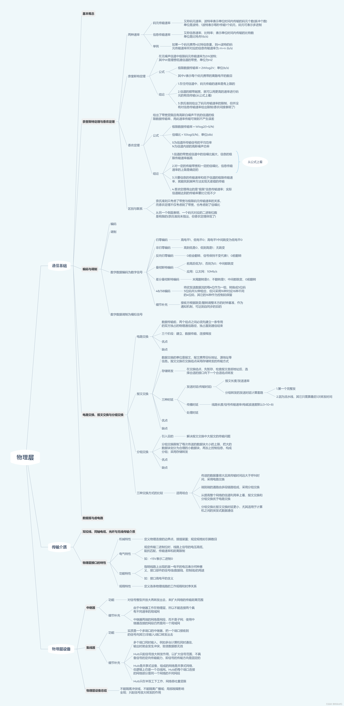
