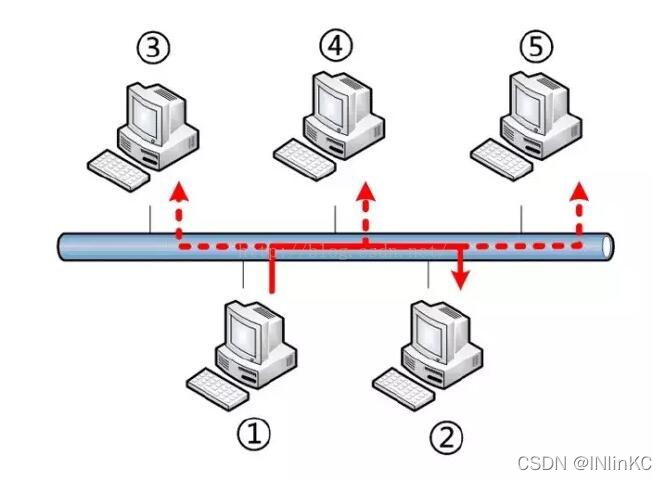
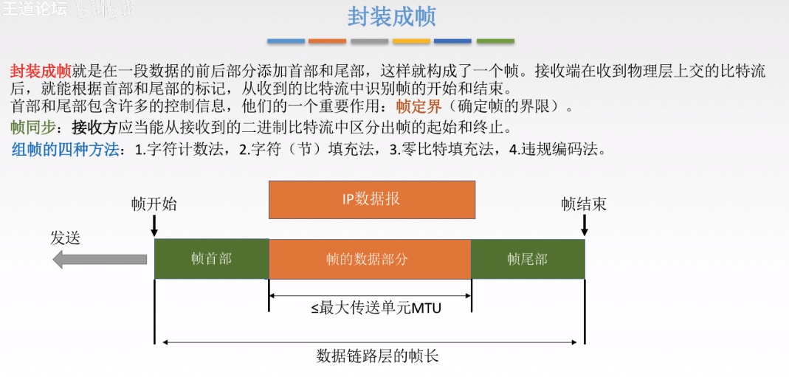
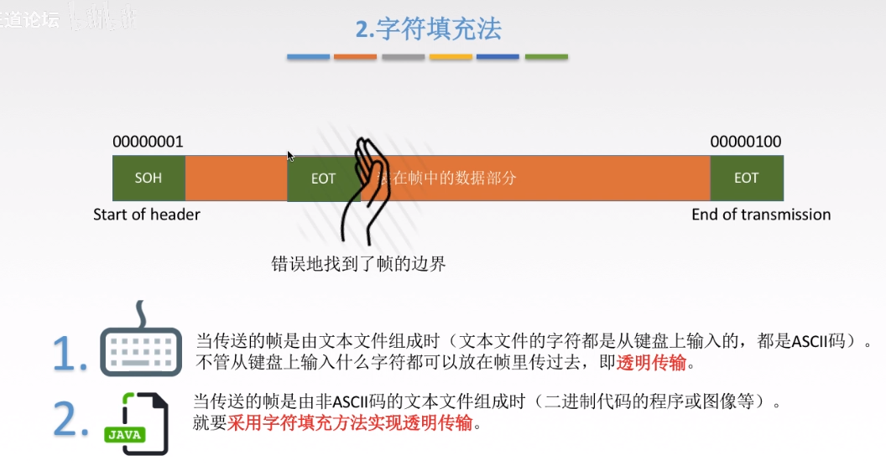
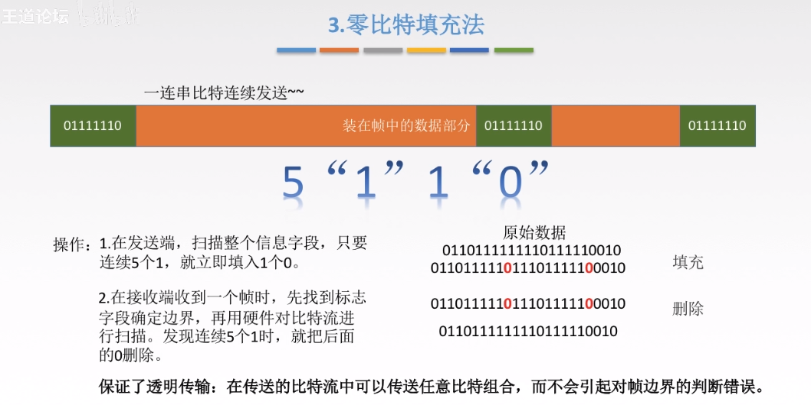
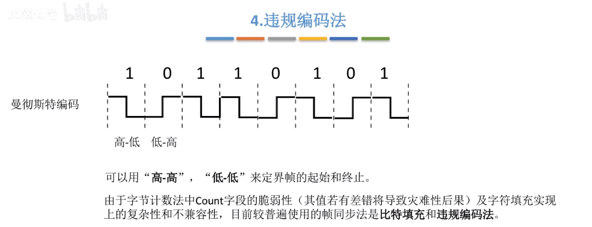
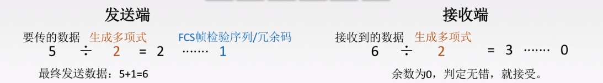

# 3.数据链路层（Data Link Layer）

## 基本概念

> 物理层为我们传输01电信号做出了不少贡献。但是在物理层也提到，物理层自己不知道自己传输的信号有什么意义。
>
> 这就是”链接层”的功能，它规定了解读方式：多少个电信号算一组？每个信号位有何意义？

### 链路层编址

> 以太网规定，一组电信号构成一个数据包，叫做”帧”（Frame）。每一帧分成两个部分：标头（Head）和数据（Data）。
>
> “标头”包含数据包的一些说明项，比如发送者、接受者、数据类型等等；”数据”则是数据包的具体内容。
>
> “标头”的长度，固定为18字节。”数据”的长度，最短为46字节，最长为1500字节。因此，整个”帧”最短为64字节，最长为1518字节。如果数据很长，就必须分割成多个帧进行发送。

### MAC地址

> 上面提到，以太网数据包的”标头”，包含了发送者和接受者的信息。那么，发送者和接受者是如何标识呢？
>
> 以太网规定，连入网络的所有设备，都必须具有”网卡”接口。数据包必须是从一块网卡，传送到另一块网卡。网卡的地址，就是数据包的发送地址和接收地址，这叫做MAC地址。长度为6字节，共48比特，通常用十六进制表示法，地址的每个字节被表示为一对十六进制数
>
> 每个适配器具有一个唯一的MAC地址，不随位置发生变化（就像人的身份证，而IP则像人的邮政地址）
>
> 一台路由器的每个接口都有一个ARP模块和一个适配器；
>
> MAC地址分配：当一个公司要生产适配器时，它支付象征性的费用购买一块MAC地址空间，IEEE分配这块地址时，固定前24比特，让公司自己为每个适配器生成后24比特的唯一组合

### ARP协议(地址解析协议)

> 通过MAC，我们定义了地址。但是我们紧接着就有一个问题，那就是一块网卡怎么会知道另一块网卡的MAC地址？
> 答案就是ARP协议。
>
> 每个节点的ARP模块都在它的RAM中有一个ARP表，包含IP地址到MAC地址的映射关系，每个表项还包含TTL字段，表示表项过期时间（ARP表是自动创建的，如果某节点与子网断开连接，它的表项最终会从留在子网中的节点的表中删除。通常一个表项的过期时间是20分钟）
>
> 主机向其ARP模块提供一个IP地址，ARP模块返回IP地址对应的MAC地址
> （注释：在OSI七层模型中，ARP属于链路层模型，所以这里也先简单介绍一下，构建知识体系）

### 广播的概念

> 其次，就算有了MAC地址，系统怎样才能把数据包准确送到接收方？
>
> 回答是以太网采用了一种很”原始”的方式，它不是把数据包准确送到接收方，而是向本网络内所有计算机发送，让每台计算机自己判断，是否为接收方。

> 上图中，1号计算机向2号计算机发送一个数据包，同一个子网络的3号、4号、5号计算机都会收到这个包。它们读取这个包的”标头”，找到接收方的MAC地址，然后与自身的MAC地址相比较，如果两者相同，就接受这个包，做进一步处理，否则就丢弃这个包。这种发送方式就叫做”广播”（broadcasting）。
>
> 有了数据包的定义、网卡的MAC地址、广播的发送方式，”链接层”就可以在多台计算机之间传送数据了。

## 封装成帧与透明传输

> 封装成帧就是加将网络数据报加头加尾，相当于将数据打包
>
> 透明传输就是为了防止特殊的数据无法正常传输的的情况的发生，比如说在封装成帧的过程中，可能出现数据中的某些标记符与开始/结束标记符恰巧重复的情况，如果不加以处理，那么会导致无法判定帧的开始于结束。

### 透明传输的实现方法
##### 字符计数法

> 就是在帧的首部做计数，这个字符记录了当前帧有多少个字符。
>
> 缺点：如果在某一个帧内，标记位后面的某个字节的数据丢失，那么会影响后面的帧
>
> 比如3 1 1 和 4 2 2 2，如果前面的帧丢失变成 3 1，那么后面的4就会被补到前面变成 3 1 4导致错误

#### 字符填充法

> 就是加头加尾分别标记开始结束，和零比特填充法（见下）对比，开始和结束的对应的字符不一样
>
> 但有可能出现数据内某段比特流数据正好与标记字段重复，从而导致误判断的情况

解决方法：添加转义字符。即对于那些与标记字符重复的数据流，在它们的前面添加一段转义字符，这样接收方在解析帧时，看到这些转义字符就不会认为那些特殊的数据当成帧的开始/结束了。

#### 零比特填充法

#### 违规编码法

因为曼彻斯特编码不使用高-高，低-低来表示，所以如果使用高-高，低-低来表示帧起始和终止就不会与数据冲突

## 差错控制

### 差错是什么，从哪来的

> 数据链路层的差错检测的是比特的错误
>
> 需要注意的是，即使采用差错检测比特，也还是可能有未检出比特差错的情况。
>
> 因此，主要是选择一个差错检测方案，使得这种事件发生的概率很小

### 为什么要在数据链路层进行差错控制？

> 因为错误可以尽早发现，不会让一个错误的数据包发送了很长时间到达最终目的地之后才被发现，从而导致网络资源的浪费

### 检错编码（奇偶校验码，循环冗余码CRC）

#### 奇偶校验码

> 奇偶校验：只需包含1个附加比特。
> 
> 对于偶校验，选择一个值，使得所有比特中1出现偶数次。
> 
> 对于奇校验，选择一个值，使得所有比特中1出现奇数次。接收方通过检测1出现的次数判断是否出现差错。如果出现偶数个比特差错，则检验不出
> 
> 缺点：只能检测出1，3，5，7…等等奇位数错误，检测成功率位50%

#### 循环冗余码CRC

> 发送方和接收方协商一个r+1比特的生成多项式(G)，要起其最高比特位为1。发送方通过在d比特的数据后附加r比特，使得整个(d+r)比特的值能够被G整除。接收方用G去除(d+r)比特，如果余数非0，则出现差错

实际例子
注释：
1. 阶数就是最高位是哪位，然后位数-1，如10011就是5-1=4,1011就是4-1=3
2. 异或运算就是相同得0，不同得1，比如100和101做异或，结果就是001
3. 出书和最后的余数添加到要发送的数据后面，称为帧检验序列FCS

接收方收到数据后进行检测

需要注意的地方

### 纠错编码（海明码）

