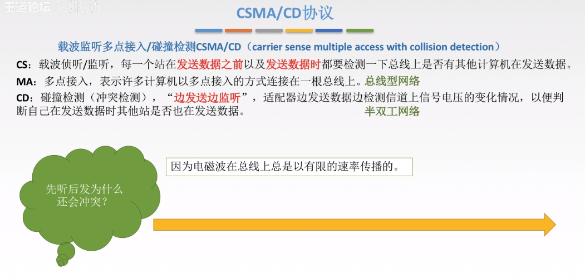

# 3.数据链路层（Data Link Layer）

## 1. 基本概念

> 物理层为我们传输01电信号做出了不少贡献。但是在物理层也提到，物理层自己不知道自己传输的信号有什么意义。
> 
> 这就是”链接层”的功能，它规定了解读方式：多少个电信号算一组？每个信号位有何意义？

### 链路层编址

> 以太网规定，一组电信号构成一个数据包，叫做”帧”（Frame）。每一帧分成两个部分：标头（Head）和数据（Data）。
> 
> “标头”包含数据包的一些说明项，比如发送者、接受者、数据类型等等；”数据”则是数据包的具体内容。
> 
> “标头”的长度，固定为18字节。”数据”的长度，最短为46字节，最长为1500字节。因此，整个”帧”最短为64字节，最长为1518字节。如果数据很长，就必须分割成多个帧进行发送。

### MAC地址

> 上面提到，以太网数据包的”标头”，包含了发送者和接受者的信息。那么，发送者和接受者是如何标识呢？
> 
> 以太网规定，连入网络的所有设备，都必须具有”网卡”接口。数据包必须是从一块网卡，传送到另一块网卡。网卡的地址，就是数据包的发送地址和接收地址，这叫做MAC地址。长度为6字节，共48比特，通常用十六进制表示法，地址的每个字节被表示为一对十六进制数
> 
> 每个适配器具有一个唯一的MAC地址，不随位置发生变化（就像人的身份证，而IP则像人的邮政地址）
> 
> 一台路由器的每个接口都有一个ARP模块和一个适配器；
> 
> MAC地址分配：当一个公司要生产适配器时，它支付象征性的费用购买一块MAC地址空间，IEEE分配这块地址时，固定前24比特，让公司自己为每个适配器生成后24比特的唯一组合

### ARP协议(地址解析协议)

> 通过MAC，我们定义了地址。但是我们紧接着就有一个问题，那就是一块网卡怎么会知道另一块网卡的MAC地址？
> 答案就是ARP协议。
> 
> 每个节点的ARP模块都在它的RAM中有一个ARP表，包含IP地址到MAC地址的映射关系，每个表项还包含TTL字段，表示表项过期时间（ARP表是自动创建的，如果某节点与子网断开连接，它的表项最终会从留在子网中的节点的表中删除。通常一个表项的过期时间是20分钟）
> 
> 主机向其ARP模块提供一个IP地址，ARP模块返回IP地址对应的MAC地址
> （注释：在OSI七层模型中，ARP属于链路层模型，所以这里也先简单介绍一下，构建知识体系）

### 广播的概念

> 其次，就算有了MAC地址，系统怎样才能把数据包准确送到接收方？
> 
> 回答是以太网采用了一种很”原始”的方式，它不是把数据包准确送到接收方，而是向本网络内所有计算机发送，让每台计算机自己判断，是否为接收方。

> 上图中，1号计算机向2号计算机发送一个数据包，同一个子网络的3号、4号、5号计算机都会收到这个包。它们读取这个包的”标头”，找到接收方的MAC地址，然后与自身的MAC地址相比较，如果两者相同，就接受这个包，做进一步处理，否则就丢弃这个包。这种发送方式就叫做”广播”（broadcasting）。
> 
> 有了数据包的定义、网卡的MAC地址、广播的发送方式，”链接层”就可以在多台计算机之间传送数据了。

## 2. 封装成帧与透明传输

> 封装成帧就是加将网络数据报加头加尾，相当于将数据打包
> 
> 透明传输就是为了防止特殊的数据无法正常传输的的情况的发生，比如说在封装成帧的过程中，可能出现数据中的某些标记符与开始/结束标记符恰巧重复的情况，如果不加以处理，那么会导致无法判定帧的开始于结束。

### 2.1 透明传输的实现方法

##### 2.1.1 字符计数法

> 就是在帧的首部做计数，这个字符记录了当前帧有多少个字符。
> 
> 缺点：如果在某一个帧内，标记位后面的某个字节的数据丢失，那么会影响后面的帧
> 
> 比如3 1 1 和 4 2 2 2，如果前面的帧丢失变成 3 1，那么后面的4就会被补到前面变成 3 1 4导致错误

#### 2.1.2 字符填充法

> 就是加头加尾分别标记开始结束，和零比特填充法（见下）对比，开始和结束的对应的字符不一样
> 
> 但有可能出现数据内某段比特流数据正好与标记字段重复，从而导致误判断的情况

解决方法：添加转义字符。即对于那些与标记字符重复的数据流，在它们的前面添加一段转义字符，这样接收方在解析帧时，看到这些转义字符就不会认为那些特殊的数据当成帧的开始/结束了。

#### 2.1.3 零比特填充法

#### 2.1.4 违规编码法

因为曼彻斯特编码不使用高-高，低-低来表示，所以如果使用高-高，低-低来表示帧起始和终止就不会与数据冲突

## 3. 差错控制

### 3.1 差错是什么，从哪来的

> 数据链路层的差错检测的是比特的错误
> 
> 需要注意的是，即使采用差错检测比特，也还是可能有未检出比特差错的情况。
> 
> 因此，主要是选择一个差错检测方案，使得这种事件发生的概率很小

### 3.2 为什么要在数据链路层进行差错控制？

> 因为错误可以尽早发现，不会让一个错误的数据包发送了很长时间到达最终目的地之后才被发现，从而导致网络资源的浪费

### 3.3 检错编码（奇偶校验码，循环冗余码CRC）

#### 3.3.1 奇偶校验码

> 奇偶校验：只需包含1个附加比特。
> 
> 对于偶校验，选择一个值，使得所有比特中1出现偶数次。
> 
> 对于奇校验，选择一个值，使得所有比特中1出现奇数次。接收方通过检测1出现的次数判断是否出现差错。如果出现偶数个比特差错，则检验不出
> 
> 缺点：只能检测出1，3，5，7…等等奇位数错误，检测成功率位50%

#### 3.3.2 循环冗余码CRC

> 发送方和接收方协商一个r+1比特的生成多项式(G)，要起其最高比特位为1。发送方通过在d比特的数据后附加r比特，使得整个(d+r)比特的值能够被G整除。接收方用G去除(d+r)比特，如果余数非0，则出现差错

实际例子
注释：

1. 阶数就是最高位是哪位，然后位数-1，如10011就是5-1=4,1011就是4-1=3
2. 异或运算就是相同得0，不同得1，比如100和101做异或，结果就是001
3. 出书和最后的余数添加到要发送的数据后面，称为帧检验序列FCS

接收方收到数据后进行检测

需要注意的地方

### 3.4 纠错编码（海明码）

#### 第一步 确认校验码位数r

#### 第二步 确定校验码和数据的位置

注释：
1.为什么是10为数据位？因为4位校验码+6位信息位=10位
2.校验码放到2的几次方的位置，其他的地方按顺序放已知的信息位

#### 第三步 求出校验码的值

注释
1.先是通过二进制位确定有几位。本题中因为最大位10的二进制是1010，所以是4为，将其标注
2.然后从p1开始看，看p1的二进制位的数值和所有信息位的对应位置的数值是否相同，然后找出来这些位
这里有点难理解，这里以p1为例辅助理解，这里找出来的就是P1,D1,D2,D4,D5

然后计算异或值，比如说这里D1=1,D2=0,D4=1,D5=0,就是p1要同时和0,1，0,1进行异或之后得到0，为了标识我加粗原始计算数据
举例：0和1异或得1,1和0异或得1,1和1异或得0，那么p1和0异或得0，p1就是0了
3.其他同理，按顺序计算出P2,P3,P4,然后填入表格

#### 第四步 检测并纠错

就是和上面一样，将所有校验位进行运算，得出的结果的值就是错误的位

## 4. 数据链路层的流量控制和可靠传输

### 4.1 流量控制与可靠传输

> 流量控制是为了让传输过程中的发送速度和接受速度匹配，减少传输出错与资源浪费
> 
> 可靠传输是发送端发送什么，接收端就要受到什么

#### 4.1.1 停止等待协议（Stop-and-Wait）

> 停止等待协议的无差错情况
> 
> 注释：因为一次就一个，所以用0和1标记ack（确认序号）就行

> 停止等待协议的**有差错**情况：
> 
> 使用一个超时计时器，每发一帧就开始计时，设置时间略长于一个RTT（往返时延）。

> 发送端发送数据开始，到发送端收到来自接收端的确认（接收端收到数据后便立即发送确认），总共经历的时延
> 
> RTT=传播时延x2+处理时间(有时可能直接忽略)

停止等待协议的特点
1.简单
2.信道利用率低。大部分时间数据都在路上，发送方很长时间闲置，资源浪费

#### 4.1.2 后退N帧协议（GBN）

> 因为停止等待协议太浪费时间了，所以尝试采用GBN，发送连续多个数据帧，以增大信道利用率
> 
> 注释： 累计确认：就是收到一个确认帧，那么它和它之前的所有帧都默认已收到，反之，如果某个确认帧没收到，那么它和它之后的所有帧都默认丢失（即使收到了也丢掉），进行重传

> 下图是一个实例
> 
> 注释：此图发送2帧时丢失，所以接收方几首收到后面的帧也是直接丢弃并且发送最晚收到的有效帧1的ACK，直至2帧的超时重传机制被触发进行重传并得到ACK之后，接收方才会接受2帧以及后面的帧
> 
> 如果所示，GBN的形式就像排队，接收端为所有帧“预定”了接收位置，如果接收端发送的数据因为某些原因没有接收到，即使收到了这一帧后面所有的帧，这些“排在后面的”帧也要被丢弃

> 发送窗口不能无限大，与使用的编号的比特数有关，二进制表示。
> 
> 很简单，就是1比特编号0和1,
> 
> 同理2比特编号0-3，二进制表示就是00，01，10，11。
> 
> 如果用1比特编号，却要4个窗口长度，那么窗口内数据编号都编不过来，直接乱套了
> 
> GBN的优缺点也显而易见，优点是相对于上面的停止等待协议，明显提高了信道利用率，缺点是因为重传机制的原因，导致已经收到数据却需要强行丢弃，进而造成浪费

#### 4.1.3 选择重传协议（SR）

吸取了GBN协议的教训，我们打算尝试只重传错误的帧，这样的话就不用浪费资源把已经收到的帧再重传一次了。
在GBN中，仅有接收端有一个窗口来存放数据帧，在SR中，两者都有窗口了。
和GBN的区别其实就是做了一个数据缓存，已经收到的帧不用扔了，等待之前因意外丢失的帧收到的时候确认即可，但是只能缓存窗口尺寸内的包含的帧（注释：缓存不可能无限大）
SR运行过程
注释：2帧丢失之后仍然在发送，但是2帧丢失之后只是缓存，并没有移动窗口；它可以继续接受窗口范围内排在2帧后面的数据帧，直至最后2帧收到后一次性确认窗口内的所有已经收到的帧，再移动窗口。

同样的，因为编号的问题，发送窗口不能无限大
当发送窗口最后和接受窗口**大小相同**时，利用率比较高

## 5. 介质访问控制技术

> 就是让节点之间的通信不会进行相互干扰

### 5.1 信道划分协议

> 虽然使用一条共享信道，但是通过多路复用技术组合进行传输，提高了信道的利用率

#### 5.1.1 频分多路复用FDM

#### 5.1.2 时分多路复用TDM

> TDM的缺点就是利用率低，所以又衍生出了STDM

#### 5.1.3 统计时分复用STDM

> STDM的原则是先到先走，满了就发，相对于TDM提高了利用率

#### 5.1.4 码分多路复用CDM

> 每个节点分配一种不同的编码，每个节点使用其唯一的编码来对发送的数据进行编码（如果精心选择编码，不同节点能同时传输）

### 5.2 随机接入协议

> 所有用户都可以随机发送信息，发送时可以占用全部带宽，理论上个人使用时比静态分配信道的速度更快

#### 5.2.1 ALOHA协议

> 帧到达节点时，立刻传输。如果发生碰撞，节点将立即(在完全传输碰撞帧后)以概率p重传。否则，等待一个帧传输时间，再以概率p重传。信道有效传输速率实际不是R bps，而是时隙ALOHA的一半

> 时隙ALOHA协议
> 
> 时间被划分为时隙，每个节点的时间同步，帧的传输只在时隙的开始时进行。如果发生碰撞，在下一个时隙开始时以概率p重传，否则等待一个时隙再以概率p重传…（信道有效传输速率实际不是R bps，而是0.37R bps）

#### 5.2.2 CSMA协议(载波侦听多路访问)

| 名称       | 描述                                              | 优点            | 缺点                   |
| -------- | ----------------------------------------------- | ------------- | -------------------- |
| 1-坚持CSMA | 发送信息时监听信道，一空闲下来就立即传输，信道忙也一直监听，如果发送时冲突等待随机时长后再监听 | 立即发送，利用率高     | 如果多台设备同时监听，那么会发生冲突   |
| 非坚持CSMA  | 发送信息时监听信道，如果空闲就立即传输，信道忙就随机等待一段时间后再监听            | 冲突发生的几率少      | 因为需要等待，所以利用率不高       |
| p-坚持CSMA | 发送信息时监听信道，空闲时以概率P进行传输，概率1-p不传输。信道忙就随机等待一段时间后再监听 | 冲突减少的同时效率也比较高 | 即使发生冲突也要坚持发送数据，资源被浪费 |

#### 5.2.3 CSMA/CD协议

> 概述
> 
> 因为链路实际有长短，发送数据需要时间，这个时间内可能就被其他节点当成空闲状态导致发生碰撞。
> 先侦听信道，如果没有其它节点在使用信道，则传输数据。但是有碰撞检测，如果发生碰撞，会停止传输剩下的数据，等待一个随机时间(通常比传输一帧短)后，再进行尝试。
> 
> 知道自己发生碰撞的最长时间是2τ（两倍的传播时延），就是一去一回

图示传播时延对载波监听的影响

由此我们可以想到最小帧长的问题，因为如果帧太短，帧都发送完了才检测到碰撞导致停止，导致无法停止碰撞

#### 5.2.4 CSMA/CA协议

#### 5.2.5 CSMA/CD 与 CSMA/CA的区别

### 5.3 轮询访问介质访问控制

主要包括两大类，一个是**轮询协议**，另一个是**令牌传递协议**

#### 5.3.1 轮询协议

就是选出一个代表，让他控制所有的传输
注释：
轮询开销在随着服务的节点越多，需要用于查询是否发送数据发送的数据帧也就越多，会造成一定开销
等待延迟就是因为这是轮流“邀请”，所以难免某个节点需要发送数据，但是主节点还在较远的需要里有需求的节点那边，导致需求得不到立即响应
单点故障很好理解，就是代表挂了

#### 5.3.2 令牌传递协议

> 注释：在节点之间没有收发数据的需求时，令牌在节点之间循环。
> 
> 发送数据的流程
> 
> ----》当一个节点需要时就可以获得这个令牌。然后修改这个令牌的状态（空闲->占用）
> 
> ----》再将令牌与数据帧结合，让其在节点构成的环之间流动
> 
> ----》不是目的地的节点收到令牌也不接受，直接略过，目标节点收到信息并复制一份到本地（传输完成），因为是个闭环，所以发送节点最后得到令牌
> 
> ----》最后，发送令牌的节点对令牌的内容进行检查，如果发现数据出错还要重新发一遍
> 
> 问题基本和轮询协议相同

## 6.局域网

### 6.1 局域网的概念

概括：范围大小，速度快，延迟低，节点平等

#### 6.1.1 局域网的网络拓扑结构

常用的是**总线型拓扑**

#### 6.1.2 局域网的传播介质

| 局域网   | 常用介质        |
| ----- | ----------- |
| 有线局域网 | 双绞线，同轴电缆，光纤 |
| 无线局域网 | 电磁波         |

#### 6.1.3 局域网介质访问方法

### 6.2 局域网的分类

### 6.3 IEEE802标准

#### 6.3.1 IEEE802描述的局域网参考模型

### 6.4以太网

#### 6.4.1 以太网概念

#### 6.4.2 以太网的发展

#### 6.4.3 适配器和MAC地址

#### 6.4.4 以太网MAC帧

> 注释：
> 1.这里的mac层指的是数据链路层
> 
> 2.之前说过数据链路层将上一层ip数据包加头加尾
> 
> 头就是目标地址（6字节），源地址（6字节），类型（2字节）
> 
> 尾就是FCS（帧检验序列），（4字节）
> 
> 3.前导码**不是MAC帧的一部分**，目的是使时钟同步
> 
> 4.为什么数据长度时46~1500？
> 
> 因为有最小传输字节64字节，mac占用6+6+2+4=18，所以数据最小为64-18=46，1500则是规定的默认最大字节，没有理由

#### 6.4.5 10BASE-T以太网

#### 6.4.6 高速以太网

### 6.5 无线局域网

#### 6.5.1 两种无线局域网

## 7.广域网

### 7.1 广域网的概述

概括一下，一个字大

### 7.2 PPP协议（Point-to-Point Protocol）

PPP协议是目前**使用最广泛**的数据链路层协议，拨号基本都是PPP协议
PPP协议**仅支持全双工**链路

#### 7.2.1 PPP协议需要满足的要求

#### 7.2.2 PPP协议不需要满足的要求

#### 7.2.3 PPP协议组成成分以及功能

#### 7.2.4 PPP协议的帧格式

### 7.3 HDLC协议（High-Level Data Link Control）

#### 7.3.1 HDLC协议概述

#### 7.3.2 HDLC的三种站

#### 7.3.3 HDLC的帧格式

### 7.4 PPP协议和HDLC协议对比

为什么HDLC协议更可靠，但是我们使用PPP协议？
因为现在网络要求高，数据链路层本来就是不可靠的尽力传输，差错控制这些复杂的交给了TCP等

## 8. 链路层设备

### 8.1 网桥（Bridge）

使用网桥时，由于网桥会根据mac地址进行过滤，所以**不会形成冲突域**

#### 8.1.1 两种网桥

##### 透明网桥
通过自学习来构建转发表。每一个通过网桥的数据包都会被记录下网桥收到数据时数据对应的地址和网桥自己的接口，通过许许多多的数据包的构造的缓存，网桥就可以知道哪个数据包在哪个接口，以后如果要穿数据包就知道要往哪个接口发送数据包了

##### 原路由网桥
在发送时，直接将最佳路径放到帧首部。那么网桥如何获得最佳路径？通过广播方式想目标地址发送广播，此时可能会经过不同路由产生不同的路径，目标地址收到后再将每一条路径都发一个响应帧给网桥，网桥经过对比就知道哪个接口最快了

### 8.2 交换机

> 网桥接口越来越多，网桥就变成了交换机
> 
> 交换机的任务是接收入链路层帧并将它们转发到出链路
> 
> 交换机自身对节点透明：某节点向另一节点寻址一个帧，顺利地将该帧发送进LAN，而不知道这个帧经过了某个交换机的接收与转发

1）交换机转发与过滤
过滤：交换机决定一个帧是应该转发还是应该丢弃
转发：决定一个帧应该被导向哪个接口

2）自学习(即插即用)
交换机表是自动、动态、自治地建立的，没有来自网络管理员或配置协议的任何干预。换句话说，交换机是自学习的
交换机表初始为空
源地址为DD-DD-DD-DD-DD-DD的帧从接口x到达时，如果不存在则新建一项；存在则更新当前时间
如果一段时间后，在x接口没有来自DD-DD-DD-DD-DD-DD的帧，则将该表项删除

### 8.3 冲突域和广播域

## 9. 数据链路层总结

