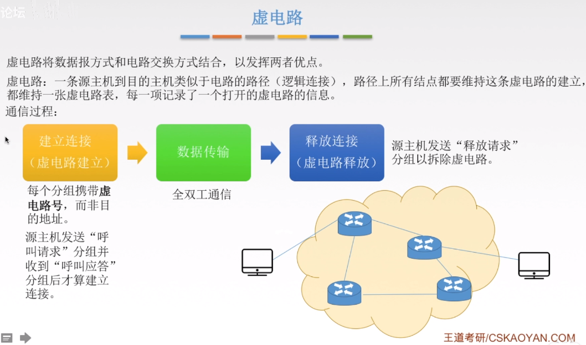
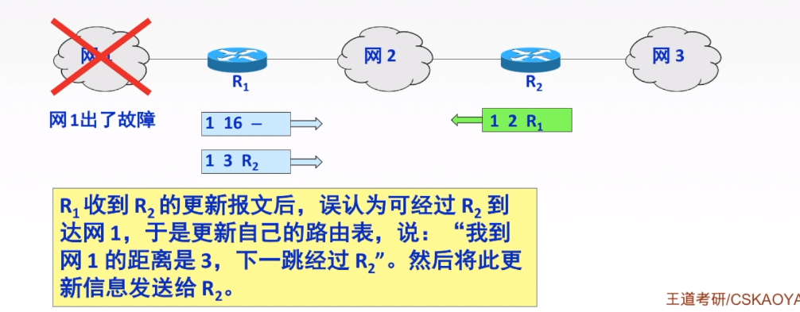
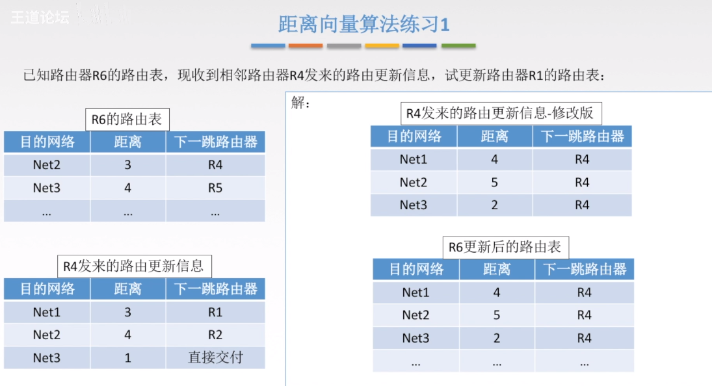

# 4.网络层（Network Layer）

## 概述

### 网络层由来

在数据链路层中，我们提到了MAC地址这个唯一的身份编址。理论上，单单依靠MAC地址，上海的网卡就可以找到洛杉矶的网卡了，技术上是可以实现的。但是，这样做有一个重大的缺点。以太网采用广播方式发送数据包，所有成员人手一”包”，不仅效率低，而且局限在发送者所在的子网络。也就是说，如果两台计算机不在同一个子网络，广播是传不过去的。这种设计是合理的，否则互联网上每一台计算机都会收到所有包，那会引起灾难。

因此，必须找到一种方法，能够区分哪些MAC地址属于同一个子网络，哪些不是。如果是同一个子网络，就采用广播方式发送，否则就采用”路由”方式发送。
这就导致了”网络层”的诞生。它的作用是引进一套新的地址，使得我们能够区分不同的计算机是否属于同一个子网络。这套地址就叫做”网络地址”，简称”网址”。于是，”网络层”出现以后，每台计算机有了两种地址，一种是**MAC地址**，另一种是**网络地址**。两种地址之间没有任何联系，MAC地址是绑定在网卡上的，网络地址则是管理员分配的，它们只是随机组合在一起。

### 网络层的主要功能

TCP/IP体系中的网络层向上只提供简单灵活的、无连接的、尽最大努力交付的数据报服务。网络层不提供服务质量的承诺，不保证分组交付的时限，所传送的分组可能出错、丢失、重复和失序。进程之间通信的可靠性由运输层（下一章）负责。

注释：
（根据评论已修正，现在关系是对的）数据报和分组的关系：数据报是一段比较长的数据，将它进行切割成一段段之后就得到分组
功能一就是让数据在路由器之间走最佳的路径
功能二就是让不同的设备（手机，电脑，平板等）都能正常连接
功能三见图中解释
开环控制就是在拥塞之前就提前设计解决
闭环控制就是在拥塞时自动调整解决问题

| OSI参考模型 | 各层次的传输单元                  |
| ------- | ------------------------- |
| 应用层     | 报文                        |
| 传输层     | 报文段                       |
| 网络层     | IP数据报，分组（如果IP数据报太大就切割成分组） |
| 数据链路层   | 帧                         |
| 物理层     | 比特流                       |

## 数据交换方式

为什么要进行数据交换？因为每个节点之间都拉网线太麻烦了也不实际，所以通过大量交换设备互联进行数据交换

### 电路交换

常见的例子：打电话
注释：
链路支持多路复用（可参考数据链路层的TDM等）
特点是独占资源，因为两者建立了连接

### 报文交换

注释：报文发送的过程
1.源先根据报文加上ip地址，物理地址等，通过物理层发送
2.交换机收到报文之后，先进行存储，等待链路空闲之后进行转发，但是转发的路径不是固定的，是比较随机的
3.最后通过许多交换机最终到达目的地

### 分组交换

分组交换和报文交换基本相同，就是将报文切割之后再进行发送

### 分组交换和报文交换的具体计算对比

注释：是怎么计算的？
报文交换：一共三段，每段都需要10000bit/1000bps=10s，三段就是3x10=30s
分组交换：可以分为两段，一个是第一个数据开始发到最后一个数据从源发出，一段是最后一个数据到达目的地。第一段总时间是10000bit/1000bps=10s，第二段总时间是（10/1000）*2=0.02s，所以总时间是10.02s。
理解一下，这里就是报文交换的时候，由于报文没有分割，所以即使先到的数据也不能先发走，只能等到最后一段报文全部到了之后才能一起走，相对于分组交换明显拖慢了前面数据的速度，所以导致报文交换明显慢于分组交换
可以看到分组交换明显快于报文交换，所以我们通常使用分组交换

### 分组传输的两种传输方式-数据报与虚电路

综述

数据报

虚电路

## 路由算法和路由协议概述

路由算法就是让路由知道收到报文之后下一步怎么走

AS就是多个路由器之间构成的单独的小圈子，圈子内使用自己的协议，圈子和圈子之间用的是BGP协议

### RIP协议和距离向量算法

#### RIP协议概述

通过交换信息构建路由表

#### 如何建立路由表

#### RIP协议报文格式

#### RIP协议特点

就是来回更新路由表，错误信息被覆盖，导致直至达到距离上限强制错误时才可以得知出错

#### 距离向量算法

注释：
为什么改地址？因为图中是从x得到的信息
为什么距离固定+1？因为路由器只从相邻路由器之间获取RIP报文，举例只会是1
为什么下一跳是x就要替换？因为网络环境不断变化，可能这次某个节点挂掉，所以保持最新的
为什么下一跳不是x时有更新和不处理两种手段？因为这样可以提高效率，比原来快就换，比原来慢就保留原来的，也可以理解

### OSPF协议和链路状态算法

#### OSPF协议概述

#### OSPF的其他特点

为什么OSPF收敛速度快？因为它只是刷新一下链路状态，得知其是否连通，不需要和RIP一样进行对照，而是直接通过Dijilstra算法来自己算出路径

#### 链路状态路由算法

了解即可

#### OSPF区域

了解即可

#### OSPF分组

了解即可

### BGP协议

#### BGP协议简介

#### BGP协议交换信息的过程

了解即可，只需要知道BGP交换协议里面交换的是一组路径向量

#### BGP协议报文格式

BGP是**应用层**协议

#### BGP协议特点

#### BGP的四种报文

### 三种路由协议的比较

## IP数据报

### IP数据报格式

注释

| 名称                          | 注释                                                    | 大小             |
| --------------------------- | ----------------------------------------------------- | -------------- |
| 版本 Version                  | ipv4或者ipv6                                            | 4位             |
| 首部长度 IHL                    | 此处数值再乘以4才是真正大小，同时因为IP数据报固定长度为20字节，所以此处最小值为5，即二进制的0101 | 4位             |
| 区分服务 DSCP + ECN             | 希望获得哪种服务，用的比较少                                        | 8位             |
| 总长度 Total Length            | 首部+数据的长度，最大为2^16-1=65535                              | 16位            |
| 标识 Identification           | 用来表示是哪一个数据报的分片，不同的分片标识各不相同                            | 8位             |
| 标志 Flags                    | 用来表示是否分片和分片是否结束                                       | 3位，但实际有用的只有后2位 |
| 片偏移 Fragment Offset         | 用来标记分片之后，该分片再原来的数据报的位置，以8字节为单位                        | 13位            |
| 生存时间 Time To Live           | 即TTL，每经过一个路由器TTL-1，0时自动放弃，根据系统不同默认的TTL不同              | 8位             |
| 协议 Protocol                 | 用来标记协议名的字段值，如TCP，UDP，ICMP等等                           | 8位             |
| 首部检验和 Header Checksum       | 检验首部的字段是否出错，出错就丢弃此数据报                                 |                |
| 源地址 Source IP Address       | 发送方ip地址                                               | 32位            |
| 目的地址 Destination IP Adresss | 接收方ip地址                                               | 32位            |
| 可选字段 Options                | 用来排错等安全检测                                             | 未知，可在0-40位之间   |
| 填充                          | 将数据报对齐成4字节的整数倍，数值全部为0                                 |                |

计算偏移量时记住是以0开始的就行，以每一篇最开始的除以8得到的数值就是偏移量
MF和DF的定义见上图

## IP

### ipv4地址

**全球唯一**的表示某一个主机或者路由器接口的编码

#### ip地址分类

#### 特殊ip地址

#### 私有ip地址

解释一下
为什么A类最大是126.xxx.xxx.xxx？
因为网络号最开始第一位是0，一共八位，所以二进制表示位0xxxxxxx，最大就是2^7-1=127，但是因为127.xxx.xxx.xxx是特殊ip地址，所以将其去掉
为什么B类最大是191.255.xxx.xxx？
因为网络号最开始第一位是10，一共八位，所以二进制表示位10xxxxxx，最大就是10111111=191，最小就是10000000=128，无特殊ip地址
为什么C类最大是223.255.xxx.xxx？
因为网络号最开始第一位是110，一共八位，所以二进制表示位110xxxxx，最大就是11011111=223，最小就是10000000=192，无特殊ip地址

### 网络地址转换NAT

注释：连接内网和外网，就是找个代理的用它的ip地址与外面收发数据
NAT需要构建NAT转换表，既要存广域网（WAN，外网）也要存局域网（LAN，内网）的ip地址和端口号

### 子网划分和子网掩码

#### 为什么需要子网划分

总结一下，就是ip不够用，所以需要额外整个子网扩展ip

注释：
为什么子网好能全0或者全1：因为CIDR编址（可见下一段）
为什么主机号不能全0或者全1：因为全0代表本网络，全1代表广播分组

#### 子网掩码

子网掩码就是用来和ip地址一起计算子网的地址的
方法就是讲子网掩码逐位写成二进制然后而原来ip地址进行与运算，就可以得到子网ip地址
因为255是11111111，所以如果写着255的话，ip地址和子网ip地址对应的地方的数值就相同

这道题可以看出来，即使子网掩码不同，相同ip地址对应的子网ip地址也可能相同
但是子网掩码不同，划分的**子网数目不同**
为什么划分的子网数目不同？或者说怎么算划分的子网位数目？
以255.255.192.0为例，255是11111111即八个1,192是11000000即2个1，一共是82+2=18个1，一共有32位地址，所以剩余有32-18=14位
以255.255.224.0为例，255是11111111即八个1,224是11100000即3个1，一共是82+3=19个1，一共有32位地址，所以剩余有32-19=13位

这道题先将255.255.252.0计算出一共有8+8+6=22位网络号位
所以就有32-22=10位主机号位
将180.80.77.55解析，可以知道在77部分某部分开始会用来表示主机号位
77的二进制是0100 1101，因为一共有22位网络号位，所以010011 （此处分开） 01，从这个01开始是主机号位。
所以用来表示子网ip地址的应该是180.80.76（010011 00）.xxx PS注意76括号内后两位二进制00
但是本体是发布广播地址，所以主机号全部都要是1
所以应该是180.80.79（010011 11）.255（11111111）注意79括号内后两位二进制11

注释：
1.这里特定主机路由就是指找特定的处理这里这个ip地址的路由
2.默认路由会将这个数据报发给另一个路由，直至找到对应的路由，或者TTL耗尽被丢弃

### 无分类编制CIDR

使用CIDR可以聚合网络
如图，通过缩短前缀，R1和R2就可以合并在206.1.0.0/16的子网下
但是这样转发表之中就会有多个匹配结果，所以我们使用最长前缀匹配

最长前缀匹配就是在计算后符合同一子网的时候，选前缀越长的
这道题选B

因为本网络是192.168.5.0/24，就是192.168.5.（0000 0000）/24，将248写成二进制是11111 000，有五个1，所以前五位都可以作为子网的编号，剩下的三位就是用来分配子网内剩余的地址了，因为不能全0或者全1，所以还要减2

### ARP协议

### DHCP协议

### ICMP协议

#### ICMP协议概述

ICMP，IGMP处于网络层和传输层之间，就是为了更好地转发ip数据报和提高交互成功的几率

#### ICMP差错报告报文

ICMP差错报告报文如何与IP数据报结合

五种ICMP差错报文

其中源点抑制已废弃不用

四种不发送ICMP差错报文的情况
注释：组播是指由一点到多点，但不是无脑发到所有点，无脑发到所有点的是广播，组播有筛选条件

#### ICMP询问报文

四种ICMP询问报文
后两种是掩码地址请求和回答报文，路由器询问和通告报文，这两个已经废弃不再使用

#### ICMP的应用

1.ping命令：测试两个主机之间连通性，使用了ICMP回送请求和回答报文
2.traceroute命令：跟踪一个分组从原点到终点的路径，使用了ICMP时间超过差错报告报文
traceroute命令讲解 https://blog.csdn.net/llq_200/article/details/81034345

## IPV6

### 为什么会有IPV6

就是IPV4地址用完了，从根本上增加ip地址数目，之前讲的NAT和CIDR也只是在IPV4的基础上扩展了IPV4地址数目，治标不治本

### IPV6地址表示形式

### IPV6数据报格式

