# 传输层（Transport Layer）

## 1.概述

### 1.1 传输层的意义

**传输层的由来**

有了MAC地址和IP地址，我们已经可以在互联网上任意两台主机上建立通信。
接下来的问题是，同一台主机上有许多程序都需要用到网络，比如，你一边浏览网页，一边与朋友在线聊天。当一个数据包从互联网上发来的时候，你怎么知道，它是表示网页的内容，还是表示在线聊天的内容？
也就是说，我们还需要一个参数，表示这个数据包到底供哪个程序（进程）使用。这个参数就叫做”端口”（port），它其实是每一个使用网卡的程序的编号。每个数据包都发到主机的特定端口，所以不同的程序就能取到自己所需要的数据。
“端口”是0到65535之间的一个整数，正好16个二进制位。0到1023的端口被系统占用，用户只能选用大于1023的端口。不管是浏览网页还是在线聊天，应用程序会随机选用一个端口，然后与服务器的相应端口联系。
“传输层”的功能，就是建立”端口到端口”的通信。相比之下，”网络层”的功能是建立”主机到主机”的通信。只要确定主机和端口，我们就能实现程序之间的交流。因此，Unix系统就把主机+端口，叫做”套接字”（socket）。有了它，就可以进行网络应用程序开发了。

网络层可以把数据从一个主机传送到另一个主机，但是没有和进程建立联系；传输层就是讲进程和收到的数据联系到一起，使数据能够为应用服务
所以说传输层是主机才有的层次

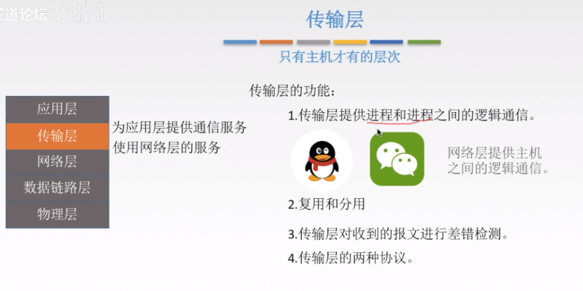

### 1.2 传输层的两个协议

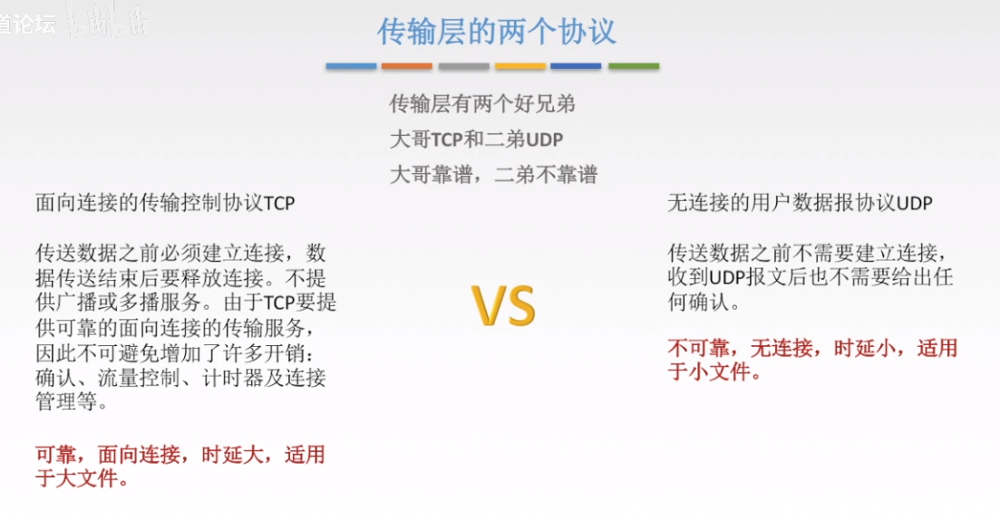

### 1.3 传输层的寻址和端口

端口号只用于计算机分辨本地进程，总共有2^16=65536种端口号，端口号有很多种，不能随便使用

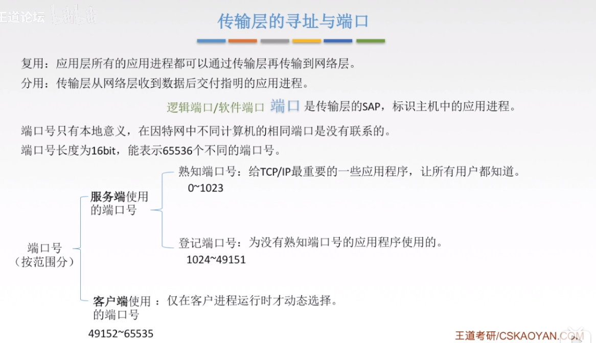

#### 1.3.1 常见的应用程序端口号

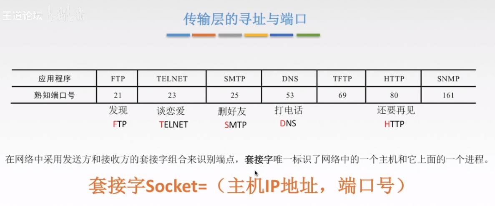

## 2. UDP协议

### 2.1 UDP概述

注释：
因为UDP一次发送一个完整报文不会分片，所以需要应用层传输过来的数据不要太大，否则网络层分片任务就很重，但是也不能太小，不然效率较低
UDP适合一些实时应用，因为实时应用延迟要求高，需要立即响应

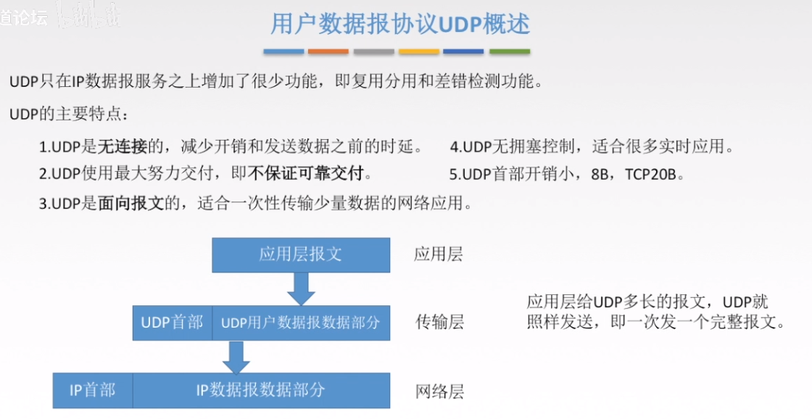

### 2.2 UDP首部格式

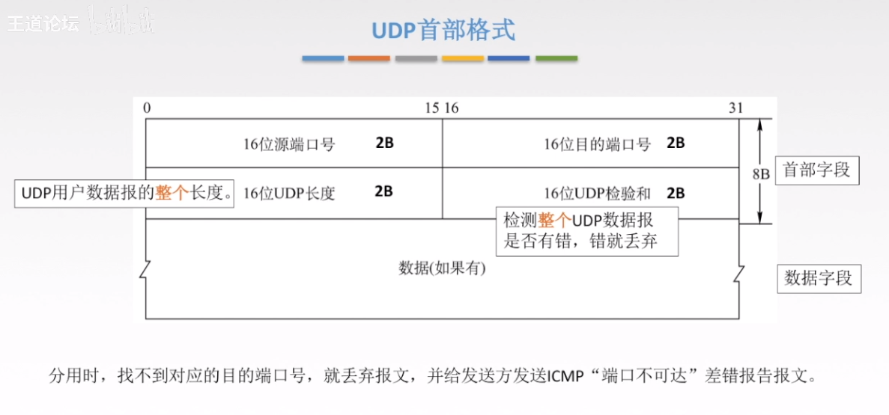

#### 2.2.1 UDP的校验位构成

这里的伪首部只是用来计算检验和的，计算完了就丢弃，可以见下UDP的校验方式

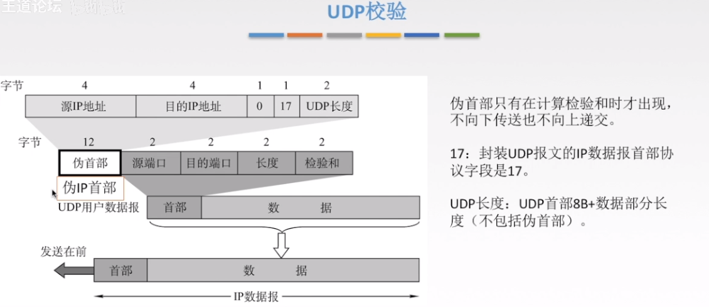

#### 2.2.2 UDP校验方式

**总结一下步骤：**

在发送端的时候：
1.就是将每一行（4字节）拆成两部分，左右平均2字节大小，将这两字节数据写成二进制，那么2字节一共就需要2*8=16位。此时检验和没有计算，默认填充0，同时如果数据字段不整齐，则用0补齐，这样就可以写出几十行二进制数，如图中方所示
2.计算着几十行二进制数按二进制反码运算求和，二进制反码运算可以参考
二进制反码求和运算 https://www.cnblogs.com/jcchan/p/10400504.html
得到的最后简介再反码，之后将反码之后的放入原来的检验和字段

在接收端的时候
与发送端的时候不同的是，此时检验和字段不是0了
按照发送端的步骤再将所有数据写成二进制进行二进制反码运算求和
如果最后得到结果全1就是没问题，否则丢弃

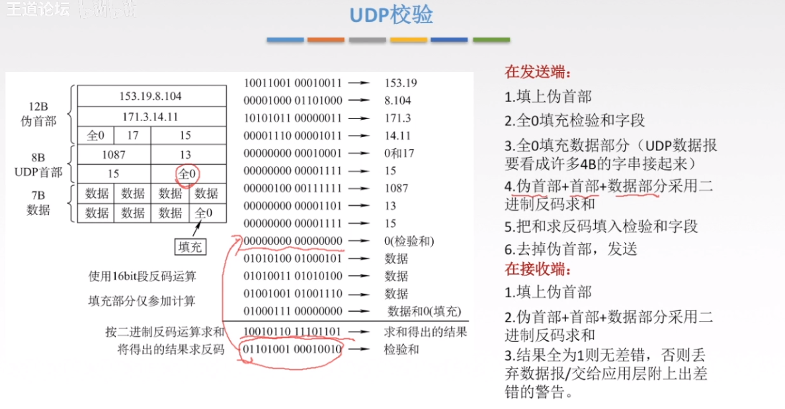

### 2.3 UDP补充

### 2.3.1 UDP怎么保证能收到数据？

UDP将可靠传输的实现放到了应用层，然后类似于TCP，实现确认机制，重传机制
UDP不属于连接型协议，因而具有消耗资源小，处理速度快等优点，所以通常音频、视频通话在传送时使用UDP比较多，因为它们即使丢失一两个数据包也不会对结果产生太大影响
UDP传输层无法保证数据的可靠传输，只能通过应用层来实现了；实现的方式可以参考TCP可靠传输的方式，只是实现不在传输层，转移到了应用层
目前有如下开源程序利用UDP实现了可靠的数据传输；分别有RUDP, RTP, UDT

## 3. TCP协议

### 3.1 TCP协议的特点

TCP必须要建立连接之后才可以进行数据交换，所以TCP是面向连接的

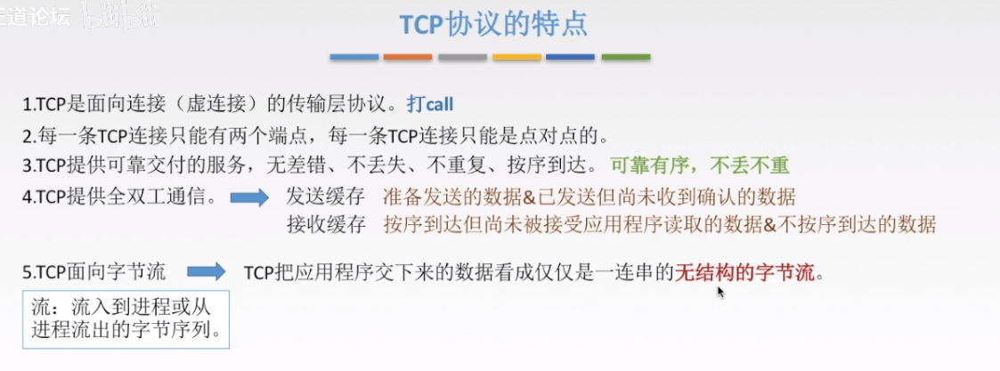

TCP传输数据是随机切割数据的

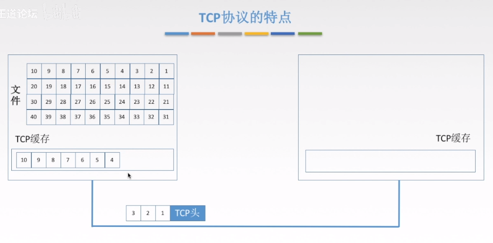

### 3.2 TCP报文段的首部

注释：
见上图，可以看到TCP是将数据随机分割后加上TCP头传输的，所以
序号就是为了标记这些随机分割之后的数据，这里把第一个字节的编号当成序号
确认号就是收到之后做一下标记，代表这之前的都收到了，希望收到的下一个编号的数据就是确认号打头的那个数据
偏移量就是为了标记一下距离TCP开始多少字节是数据，这里的单位是4B，这个偏移量就是TCP首部长度

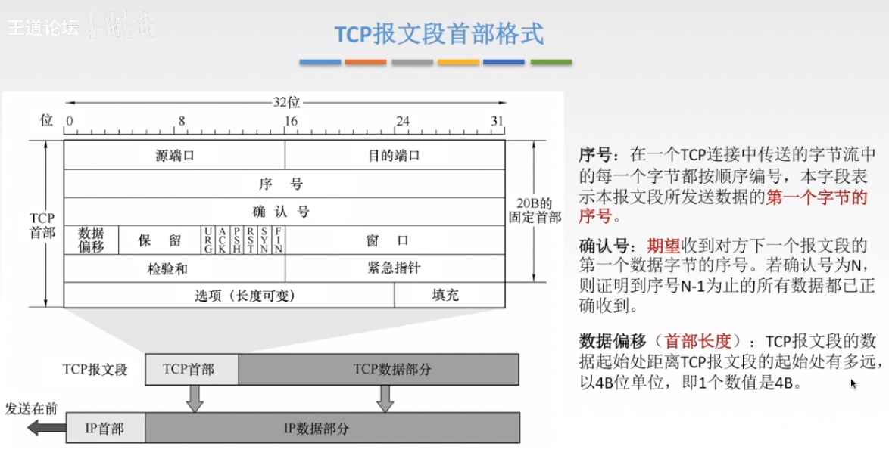

窗口就是接收方告诉发送方，还有多少地方（缓存）可以放数据
紧急指针就是告诉TCP从哪里到哪里是紧急数据

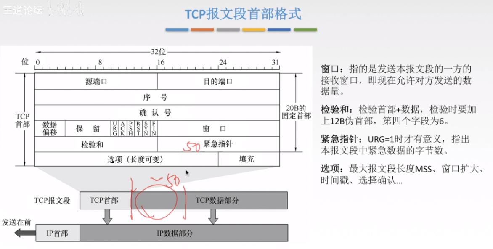

#### 3.2.1 TCP的六个控制位

**紧急位URG**
URG的特点就是让数据插队，URG=1的就会在缓存中被提前到第一个传输

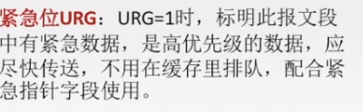

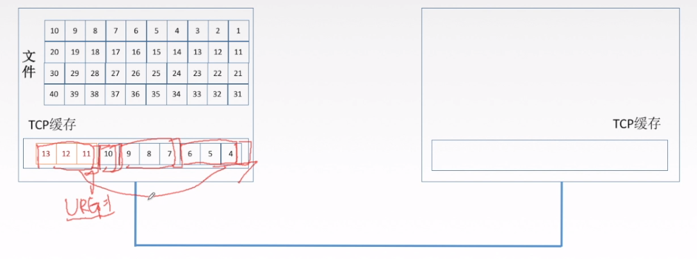

**确认位ACK**

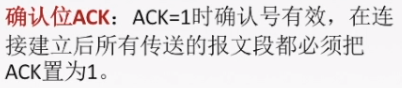

**推送位PSH**
就是接收端的URG，将PSH=1的数据尽快接收
注意一下，如果没有PSH，一般都是接收方缓存满了之后再将数据发送到主机

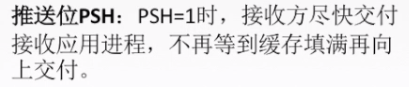

**复位RST**

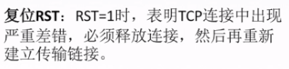

**同步位SYN**

A和B主机要建立连接，就A先发一个报文，其中SYN=1
B收到之后也回复一个SYN=1的报文，代表接受连接
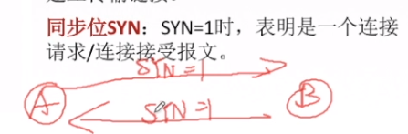

**终止位FIN**

### 3.3 TCP连接管理

#### 3.3.1 TCP三次握手（建立连接）

| 名称  | 作用                                                                        |
| --- | ------------------------------------------------------------------------- |
| SYN | 同步序号，用于建立连接过程，在连接请求中，SYN=1和ACK=0表示该数据段没有使用捎带的确认域，而连接应答捎带一个确认，即SYN=1和ACK=1 |
| FIN | 用于释放连接，为1时表示发送方没有发送了                                                      |
| ACK | 为1表示确认号有效，为0表示报文不含确认信息，忽略确认号字段，上面的确认号是否有效就是通过该标识控制的                       |
| ack | 是期望收到对方下一个报文段的第一个数据字节的序号                                                  |
| seq | TCP连接中传送的字节流中的每个字节都按顺序编号                                                  |

注释：
第一段的意思是
SYN同步序号=1：(A)要建立连接了！
seq序号=x（随机）：因为还没有数据，所以写什么都无所谓

第二段的意思是
SYN同步序号=1：我(B)同意你(A)建立连接！
ACK确认序号=1：连接建立了，之后的ACK必须都置为1
seq序号=y（随机）：因为还没有数据，所以写什么都无所谓
ack确认号=x+1：之前发送方(A)说发送的是第x位数据（虽然发送方是瞎说的），所以我(B)要的是x+1位数据

第三段的意思是
SYN=0：SYN只有在建立连接时才为1，其他时候均设为0
ACK=1：连接建立了，之后的ACK必须都置为1
seq=x+1：我(A)发送的报文段的第一个字节就是x+1
ack=y+1：之前接收方(B)说发送的是第y位数据（虽然接收方是瞎说的），所以我(A)要的是y+1位数据

注意一下，TCP是双向的，所以不存在绝对不变的发送方接收方，这里的两台主机都同时是发送方和接收方

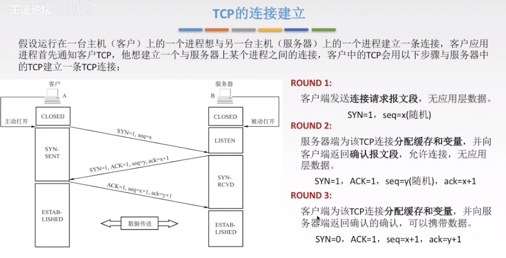

**TCP三次握手特定导致的SYN洪泛攻击**

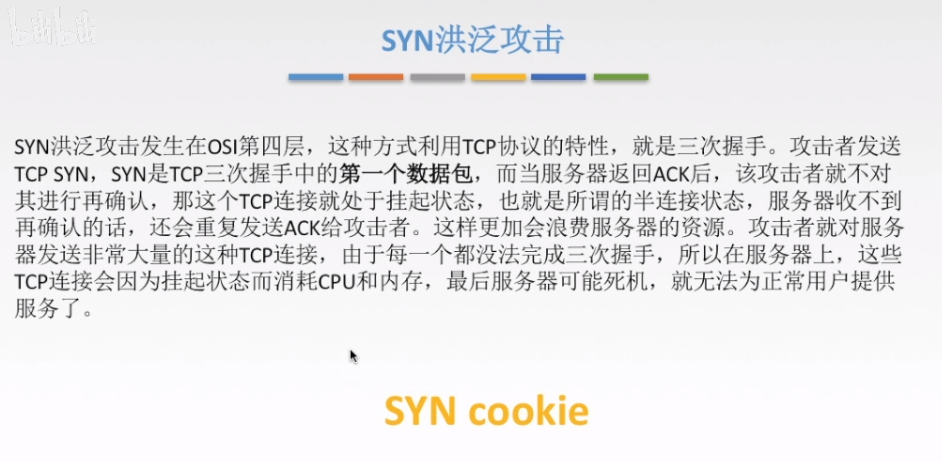

#### 3.3.2 TCP四次挥手（连接释放）

| 名称  | 作用                                                                        |
| --- | ------------------------------------------------------------------------- |
| SYN | 同步序号，用于建立连接过程，在连接请求中，SYN=1和ACK=0表示该数据段没有使用捎带的确认域，而连接应答捎带一个确认，即SYN=1和ACK=1 |
| FIN | 用于释放连接，为1时表示发送方没有发送了                                                      |
| ACK | 为1表示确认号有效，为0表示报文不含确认信息，忽略确认号字段，上面的确认号是否有效就是通过该标识控制的                       |
| ack | 是期望收到对方下一个报文段的第一个数据字节的序号                                                  |
| seq | TCP连接中传送的字节流中的每个字节都按顺序编号                                                  |

注释：
第一段的意思是
FIN=1：(A)要释放连接了！
seq=u：发了好多数据，这里只是用u指代一下，这里u是有确定值的

第二段的意思是
ACK=1：连接建立了，之后的ACK必须都置为1
seq=v：发了好多数据，这里只是用v指代一下，这里v是有确定值的
ack=u+1：之前发送方(A)说发送的是第u位数据，所以我(B)要的是u+1位数据（尽管此时A已经决定释放连接了）

第三段的意思是
FIN=1：(B)要释放连接了！
ACK=1：连接建立了，之后的ACK必须都置为1
seq=w：发了好多数据，这里只是用w指代一下，这里w是有确定值的
ack=u+1：之前发送方(A)说发送的是第u位数据，所以我(B)要的是u+1位数据（因为A直接不发数据了，所以第二段第三段的ack都是u+1）

第四段的意思是
ACK=1：连接建立了，之后的ACK必须都置为1
seq=u+1：之前发的数据时第u位数据，B也要第u+1位数据，所以我发第u+1位数据
ack=w+1：之前发送方(B)说发送的是第w位数据，所以我(A)要的是w+1位数据

为什么需要等待计时2MSL？
因为这样可以保证B可以收到A的终止报文段进而进入关闭状态
比如说如果A的第四段报文丢失，那么等待一个MSL之后B就会重传第三段报文，花费小于1MSL之后A就会再收到第三段报文，之后就可以再次向B发送第四段报文提示B关闭连接

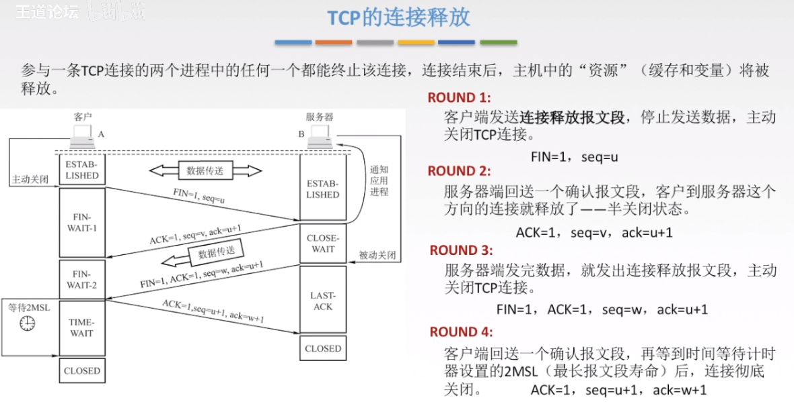

### 3.4 TCP可靠传输

TCP是提供可靠传输，UDP这种本身还是不可靠传输的就再靠应用层解决了
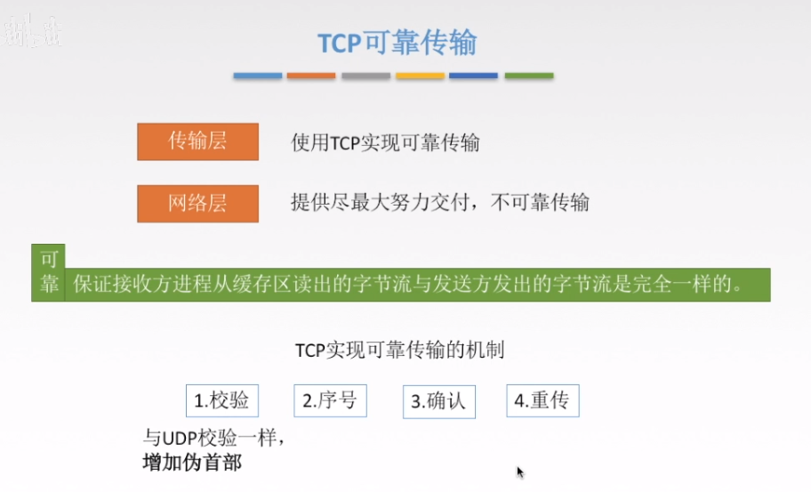

#### 3.4.1 序号

就是TCP根据下方数据链路层的MTU（最大传输单元）来随即将数据切割成好几端并且进行编号

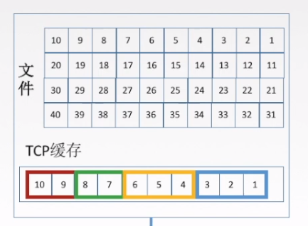

#### 3.4.2 确认

发送方每一次发送数据之后都需要接收方进行确认。
TCP使用的是累计确认机制，就是从第一个丢失的字节开始请求丢失的报文段。如图中456丢失，78到达，但仍然请求发送的数据序号是4

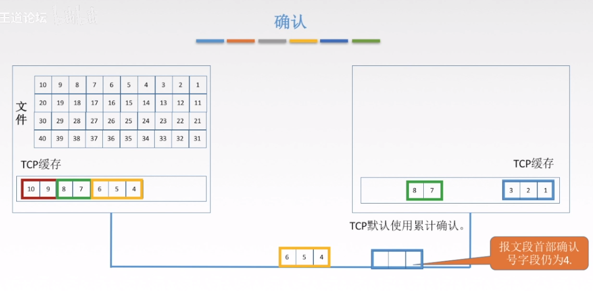

#### 3.4.3 重传

为什么要使用自适应算法？网络环境太复杂，路径又长又短，RTT设置短了照顾不了距离远的，RTT设置长了又导致网络利用率降低，所以使用RTTs

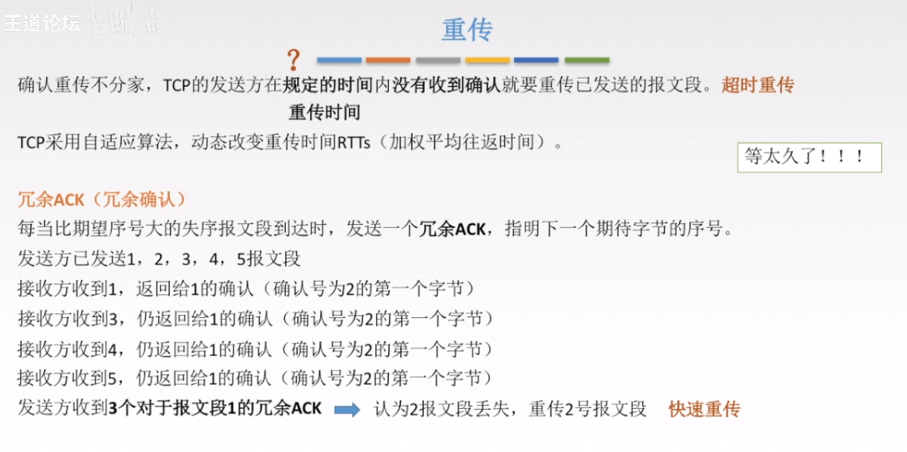

### 3.5 TCP流量控制

简单来说就是接收方可以动态的发送信息告诉发送方发送窗口的大小。
接收方接受不过来了就让发送方发送窗口小点，这样发送方发送的速率就慢下来了，接收方就有时间处理它的数据了
接受方处理完了也可以发送请求让发送方发送窗口大点，这样发送方发送的速率就快起来了，接收方就可以处理更多数据而不是空闲等着收数据了

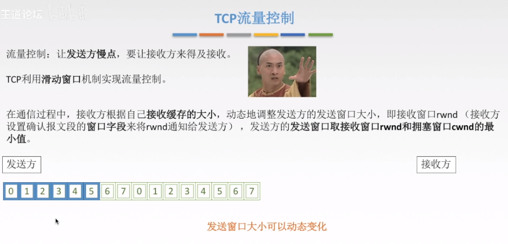

#### 3.5.1 计时器

在本例子中，使用的累计确认机制（一次回复收到ack=201）和三次流量控制机制。
但是有一个情况就是，如果最后B不允许A再发送数据了，B在处理完数据之后想要恢复窗口大小时发送的有rwnd大小的数据报丢了怎么办？此时A有B的指令在前，发送窗口为0无法发送数据，B也在等待A回复，造成了类似死锁的现象
解决方法：使用计时器

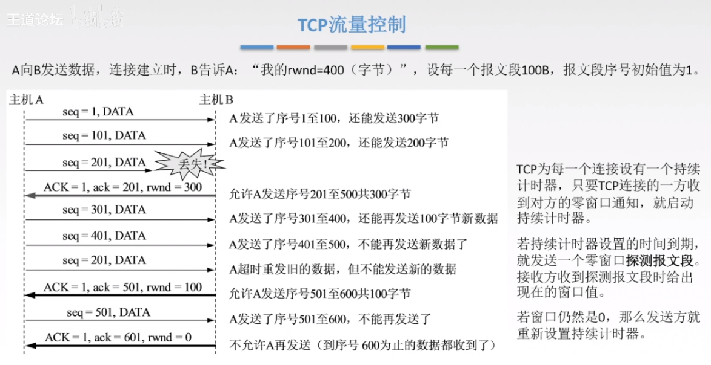

### 3.6 TCP拥塞控制

流量控制是对单独一个来说的，拥塞控制是一群

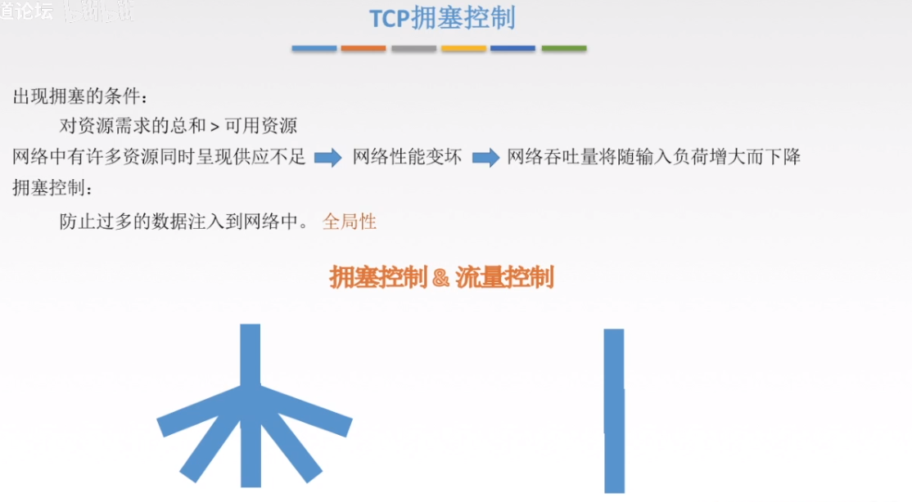

#### 3.6.1 拥塞控制四种算法

这里虽然是四种算法，但是通常是两两结合进行使用

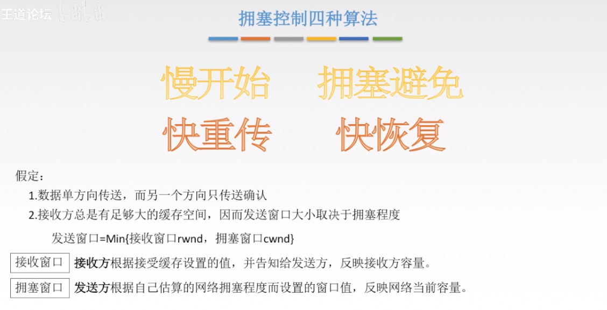

#### 3.6.2 慢开始和拥塞避免

这里开始时以**指数形式**增长，ssthresh的意思是慢开始门限，代表从这个地方注入的报文段就比较多了，需要开始慢速增加了。
之后一段都是**线性增长**，每次增加1，直至达到网络拥塞状态
瞬间将cwnd设置为1，同时调整原来的ssthresh的值到之前达到网络拥塞状态的1/2,（这里是24降到12）
重复以上步骤，但是注意此时ssthresh变了之后线性增长的转折点也变了

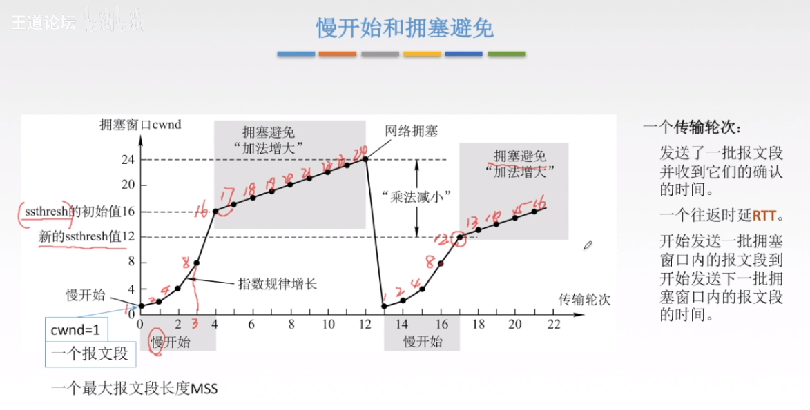

#### 3.6.3 快重传和快恢复

这里和上面的慢开始和拥塞避免的一开始步骤差不多，都是先指数增长再转变为线性增长。
不同的点是快重传和快恢复算法是在收到连续的ack确认之后执行，这里的ack就是冗余ack，冗余ack的特点是如果多次对某一段请求的数据没有被收到，达到一定数目之后就会立即执行重传。但是此时只是降到现在cwnd的一半，再重新线性增长。而不是像慢开始和拥塞避免的从头开始

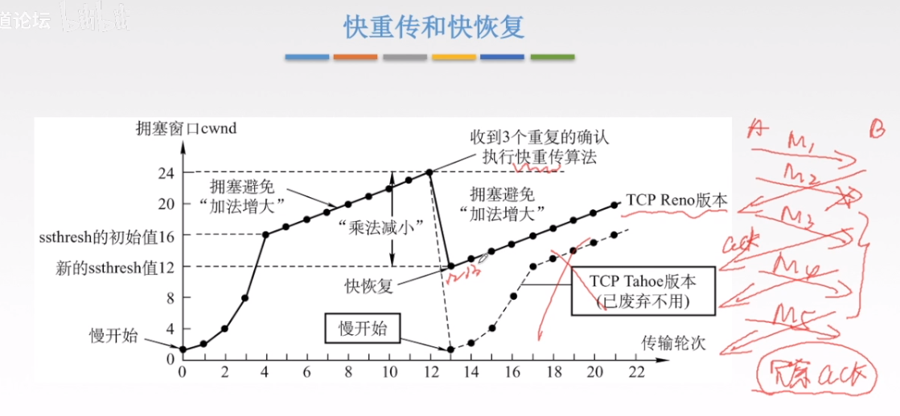

## 4. 传输层常见题目收集

### 4.1. TCP、UDP区别及使用场景
TCP面向连接（如打电话要先拨号建立连接）;UDP是无连接的，即发送数据之前不需要建立连接。
TCP提供可靠的服务。也就是说，通过TCP连接传送的数据，无差错，不丢失，不重复，且按序到达;UDP尽最大努力交付，即不保证可靠交付。TCP通过校验和，重传控制，序号标识，滑动窗口、确认应答实现可靠传输。如丢包时的重发控制，还可以对次序乱掉的分包进行顺序控制。
UDP具有较好的实时性，工作效率比TCP高，适用于对高速传输和实时性有较高的通信或广播通信。
每一条TCP连接只能是点到点的；UDP支持一对一、一对多、多对一和多对多的交互通信。
TCP对系统资源要求较多，UDP对系统资源要求较少。

### 4.2 TCP两次握手可以吗？
第三次握手主要为了防止已失效的连接请求报文段突然又传输到了服务端，导致产生问题。
比如客户端A发出连接请求，可能因为网络阻塞原因，A没有收到确认报文，于是A再重传一次连接请求。
连接成功，等待数据传输完毕后，就释放了连接。
然后A发出的第一个连接请求等到连接释放以后的某个时间才到达服务端B，此时B误认为A又发出一次新的连接请求，于是就向A发出确认报文段。
如果不采用三次握手，只要B发出确认，就建立新的连接了，此时A不会响应B的确认且不发送数据，则B一直等待A发送数据，浪费资源。

### 4.3 第四次挥手为什么要等待2MSL？
1.保证A发送的最后一个ACK报文段能够到达B。
这个ACK报文段有可能丢失，B收不到这个确认报文，就会超时重传连接释放报文段，然后A可以在2MSL时间内收到这个重传的连接释放报文段，接着A重传一次确认，重新启动2MSL计时器，最后A和B都进入到CLOSED状态，若A在TIME-WAIT状态不等待一段时间，而是发送完ACK报文段后立即释放连接，则无法收到B重传的连接释放报文段，所以不会再发送一次确认报文段，B就无法正常进入到CLOSED状态。
2.防止已失效的连接请求报文段出现在本连接中。
A在发送完最后一个ACK报文段后，再经过2MSL，就可以使这个连接所产生的所有报文段都从网络中消失，使下一个新的连接中不会出现旧的连接请求报文段。

### 4.4 如果 1、2、3 次握手分别丢包了，会发生什么？
第一次客户端发的 SYN 丢了：
客户端迟迟接不到响应，超时重传。

第二次服务端发的 SYN 和 ACK 丢了
客户端迟迟接不到响应，超时重传

第三次客户端发的 ACK 丢了？
因为第三次发完 ACK 之后，随时接下来会继续往服务端发数据，我看过一篇博客里写的是发数据时会带上 ACK，所以客户端响应的 ACK 包丢了，服务器也能够通过之后的包来建立连接。

第三次故意不发送 ACK 呢？
洪水攻击，服务器在等待第三次握手时是处于半连接状态，也是需要耗费资源的，如果有攻击者故意不发送第三次 ACK，让大量连接处于半连接状态，那么会把服务器资源耗尽，洪水攻击的目的就达到了。

## 5.本章思维导图

