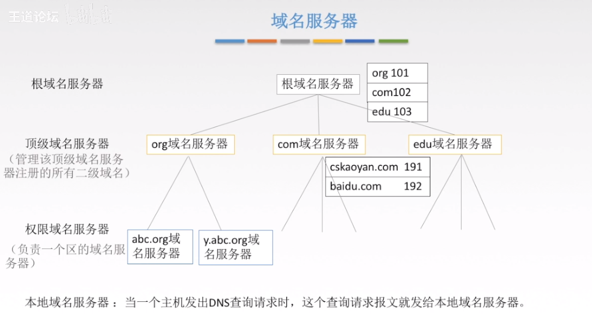

# 6.应用层（Application Layer）

## 1.概述

> 不同的网络应用之间需要有一个确定的通信规则
 

1. 两种常用的网络应用模型
   1. 客户/服务器模型（Client/Server）
      
   2. P2P模型（Peer-to-Peer）
      

## 2.域名系统协议（DNS）

1. 概述

> DNS就是将打在地址栏的域名转化为IP地址的东西

2. 域名

3. 域名服务器（DNS服务器）

> DNS服务器有很多台，根据层次结构分为三层，根域名服务器，顶级域名服务器，权限域名服务器
> 
> 本地域名服务器不算层次结构，特点是里主机比较近，当主机和另一台比较近的主机通信时，就不用走哪些更高级的服务器了
>
> 根域名服务器并不是一个域名只有一台，而是一个域名对应多台域名服务器，全世界一共有13个这样的域名，分别是a.rootservers.net，b.rootservers.net，c.rootservers.net，~m.rootservers.net
> 
> 在权限域名服务器中，虽然看似abc.com比y.abc.com少了一位，但是他们的地位仍是对等的，对应的两台权限域名服务器

  1. 域名解析过程
     
     

  - 递归查询
  - 迭代查询
  - 高速缓存

## 3.文件传输协议（FTP,TFTP）

## 4.电子邮件

## 5.万维网和HTTP协议
- 万维网概述

- HTTP协议的过程

- HTTP协议的特点

- HTTP的连接方式——持久连接和非持久连接
> 非持久连接在TCP三次握手的第三次握手时发生，将HTTP请求作为第三次握手的数据部分发给服务器，服务器收到请求之后将HTTP相应报文传输给客户。耗时就是RTT*2+文档传输时间。
缺点就是这样如果再想传输，那么就需要重新建立TCP连接从头开始
>
> 持久连接和非持久连接类似，都是在第三次握手时发生，将HTTP请求作为第三次握手的数据部分发给服务器，服务器收到请求之后将HTTP相应报文传输给客户。但是持久连接再需要请资源的时候就不需要建立新的TCP连接了

## 6.本章思维导图

