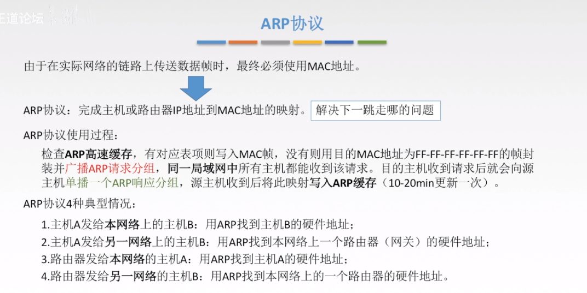

# 数据链路层

## 基本概念

> 物理层为我们传输01电信号做出了不少贡献。但是在物理层也提到，物理层自己不知道自己传输的信号有什么意义。
> 
> 这就是”链接层”的功能，它规定了解读方式：多少个电信号算一组？每个信号位有何意义？

### 链路层编址

> 以太网规定，一组电信号构成一个数据包，叫做”帧”（Frame）。每一帧分成两个部分：标头（Head）和数据（Data）。
> 
> “标头”包含数据包的一些说明项，比如发送者、接受者、数据类型等等；”数据”则是数据包的具体内容。
> 
> “标头”的长度，固定为18字节。”数据”的长度，最短为46字节，最长为1500字节。因此，整个”帧”最短为64字节，最长为1518字节。如果数据很长，就必须分割成多个帧进行发送。

### MAC地址

> 上面提到，以太网数据包的”标头”，包含了发送者和接受者的信息。那么，发送者和接受者是如何标识呢？
> 
> 以太网规定，连入网络的所有设备，都必须具有”网卡”接口。数据包必须是从一块网卡，传送到另一块网卡。网卡的地址，就是数据包的发送地址和接收地址，这叫做MAC地址。长度为6字节，共48比特，通常用十六进制表示法，地址的每个字节被表示为一对十六进制数
> 
> 每个适配器具有一个唯一的MAC地址，不随位置发生变化（就像人的身份证，而IP则像人的邮政地址）
> 
> 一台路由器的每个接口都有一个ARP模块和一个适配器； 
> 
> MAC地址分配：当一个公司要生产适配器时，它支付象征性的费用购买一块MAC地址空间，IEEE分配这块地址时，固定前24比特，让公司自己为每个适配器生成后24比特的唯一组合

### ARP协议(地址解析协议)

> 通过MAC，我们定义了地址。但是我们紧接着就有一个问题，那就是一块网卡怎么会知道另一块网卡的MAC地址？ 
> 答案就是ARP协议。 
> 
> 每个节点的ARP模块都在它的RAM中有一个ARP表，包含IP地址到MAC地址的映射关系，每个表项还包含TTL字段，表示表项过期时间（ARP表是自动创建的，如果某节点与子网断开连接，它的表项最终会从留在子网中的节点的表中删除。通常一个表项的过期时间是20分钟） 
> 
> 主机向其ARP模块提供一个IP地址，ARP模块返回IP地址对应的MAC地址
> （注释：在OSI七层模型中，ARP属于链路层模型，所以这里也先简单介绍一下，构建知识体系）

