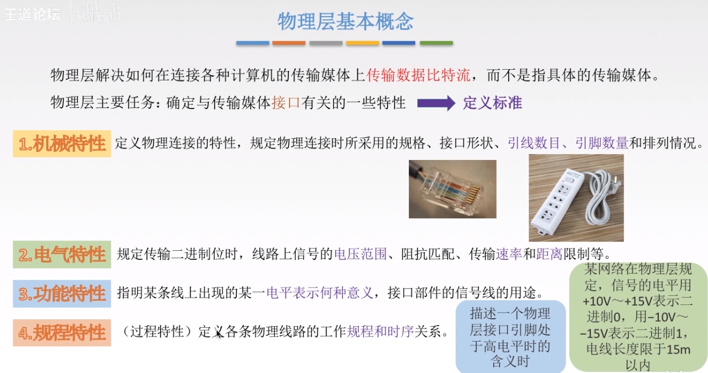
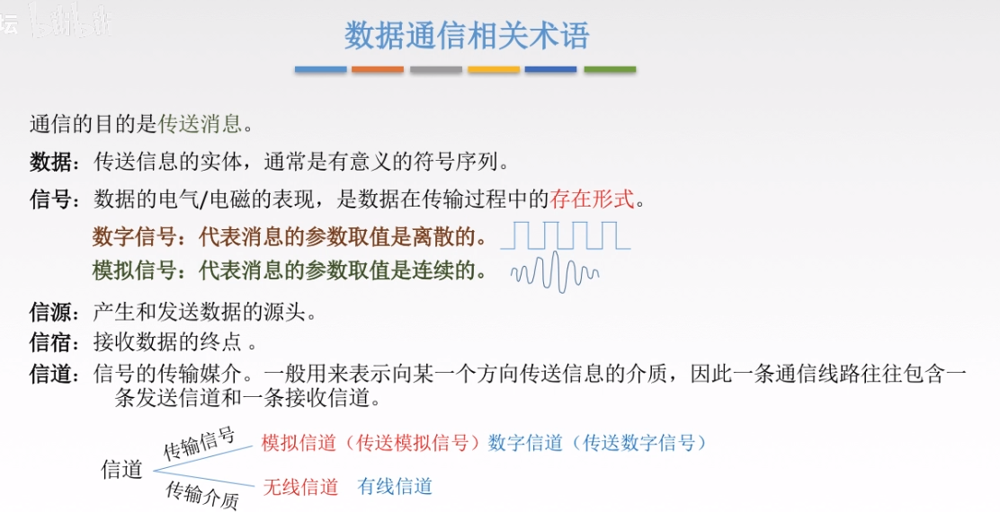
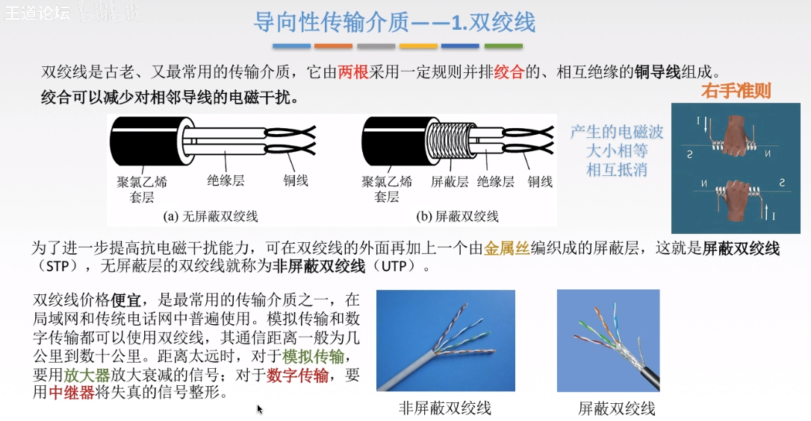
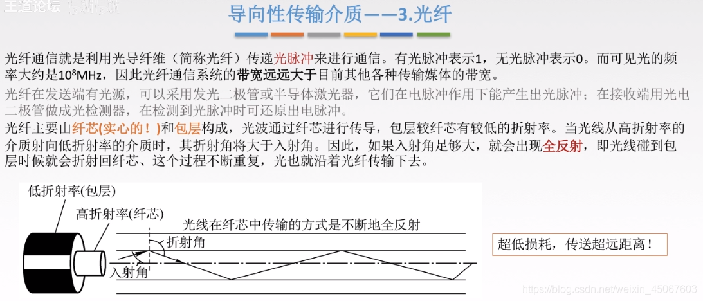
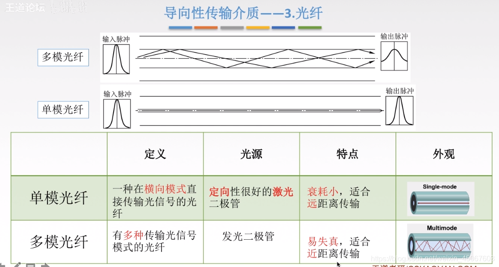
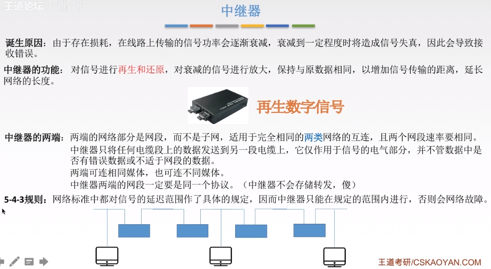
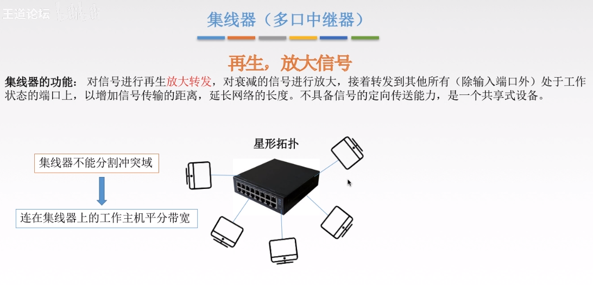

# 物理层

基本概念
> 电脑要组网，第一件事要干什么？当然是先把电脑连起来，可以用光缆、电缆、双绞线、无线电波等方式。
> 
> 这就叫做”实体层”，逼格高一点的叫法就是物理层。它就是把电脑连接起来的物理手段。它主要规定了网络的一些电气特性，作用是负责传送0和1的电信号。
> 
> 至于0和1的信号是什么，还轮不到物理层还决定。

数据通信基本知识

三种通讯方式

两种数据传输方式

码元（Symbol）  

波特（Baud）

速率

带宽（Band Width）

奈式准则（Nyquist）

> 是在理想状态下得出的结论

香农公式（Shannon）

基带信号和宽带/带通信号（Base band，pass band）

编码

调制：数据转化为模拟信号（了解）

物理层传输介质

常见的导向性传输介质

双绞线

> 根据有无屏蔽层分为屏蔽双绞线（STP）和无屏蔽双绞线（UTP）   

同轴电缆（Coaxial Cable）

光纤（Optical fiber）

常见的非导向性传输介质
> 包括无线电波，微波，红外线和激光等

物理层设备
中继器（RP repeater）
注释：5-4-3规则是为了限制中继器使用次数的，理由可见图
5是指不能超过5个网段
4是指在这些网段中的物理层网络设备（中继器，集线器）最多不超过4个
3是指这些网段中最多只有三个网段挂有计算机

集线器（Hub）
> 集线器是个大的冲突域，同时只能有两个设备进行通讯，只会传输信号，没有智能。

本章总结

