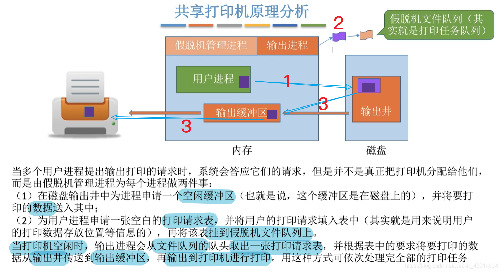

# 2. I/O核心子系统

## 1. 内核的I/O核心子系统及功能

### 0. I/O核心子系统以及功能

### 1. 这些功能在哪个层次实现？
#### 假脱机技术

#### I/O调度

#### 设备保护

## 2. I/O设备假脱机技术(SPOOLing)

### 0. 思维导图

### 1. 什么是脱机技术？

这里温习一下手工操作阶段：

- 因为手工阶段的速度慢问题，引入了脱机技术

### 2. 假脱机技术

- 在脱机技术的基础上人们发明了更好的假脱机技术

#### 输入井和输出井

#### 输入进程与输出进程

#### 输入输出缓冲区

#### 共享打印机原理分析---假脱机技术的一种应用

先了解一下独占和共享设备，以此引出假脱机技术如何实现对独占设备的共享：

- 打印请求完成后，请求表从打印队列删除，执行后续队列的打印任务

## 3. I/O设备的分配与回收（DCT-COCT-CHCT-SDT）

### 0.思维导图

### 1.设备分配时应该考虑的因素
#### 设备的固有属性

#### 设备的分配算法

#### 设备分配中的安全性

### 2.静态分配与动态分配

### 3.设备分配管理中的数据结构

设备、控制器、通道之间的关系：

#### 设备控制表---DCT

#### 控制器控制表---COCT

#### 通道控制表---CHCT

#### 系统设备表---SDT

### 4.设备分配的步骤

#### 设备分配的改进步骤

## 4. 缓冲区管理（单缓冲-双缓冲-循环缓冲-缓冲池）

### 0. 思维导图

### 1. 什么是缓冲区？有什么作用？

### 2. 单缓冲

T>C时的例子：

T<C时：

### 3. 双缓冲

T>C+M时：

T<C+M时：

### 4. 单缓冲和双缓冲通信时的区别

### 5. 循环缓冲区

### 6. 缓冲池

