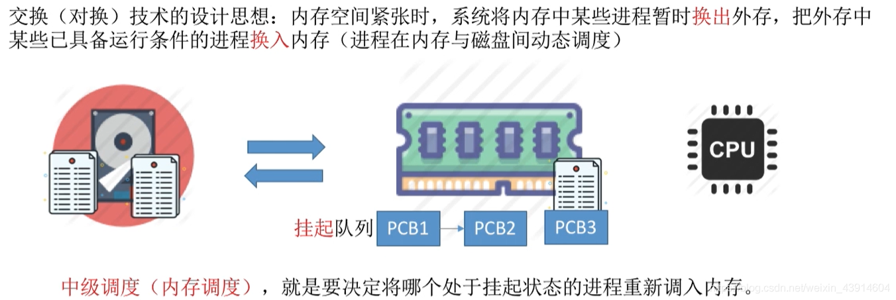
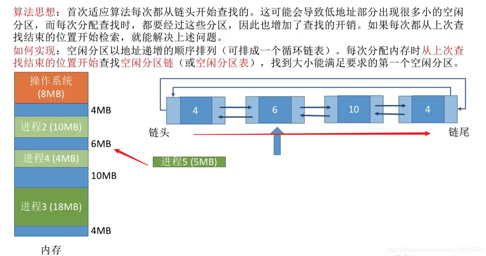
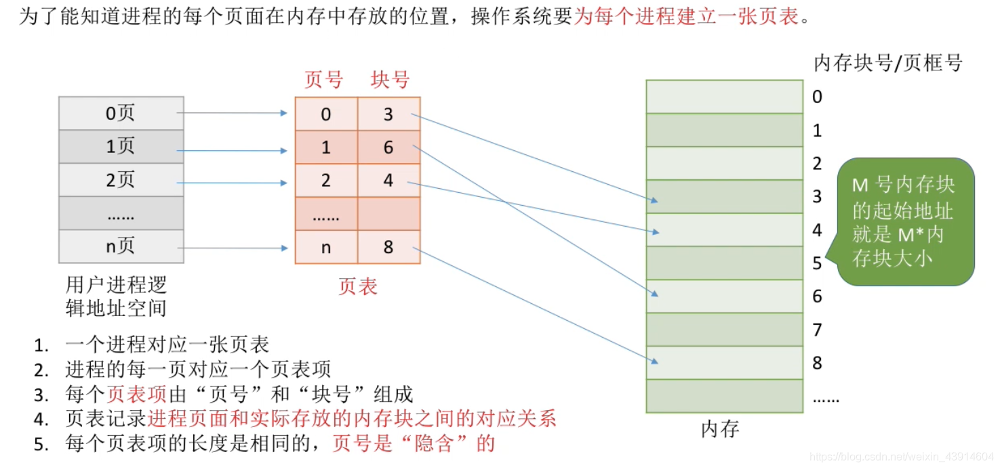

# 1. 内存管理的概念

## 1. 什么是内存？进程的基本原理，深入指令理解其过程

### 0. 思维导图

### 1. 什么是内存？有何作用？

#### （1）存储单元

https://blog.csdn.net/weixin_43914604/article/details/104099953

#### （2）几个常用数量单位&内存地址

### 2. 进程运行的基本原理
#### （1）指令的工作原理---操作码+若干参数（可能包含地址参数）

- 从X=X+1大致看一下指令的执行过程

#### （2）逻辑地址（相对地址）vs物理地址（绝对地址）

#### （3）从写程序到程序运行---编译、链接、装入

#### （4）装入模块装入内存

不修改装入模块中的指令地址就直接装入内存的话：

#### （5）装入的三种方式
##### ①绝对装入

##### ②静态重定位

##### ③ 动态重定位

#### （6）链接的三种方式
##### ① 静态链接

##### ②装入时动态链接

##### ③运行时动态链接

## 2. 内存管理管些什么？

### 0. 思维导图

### 1. 内存空间的分配与回收

### 2. 内存空间的扩展（实现虚拟性）

### 3. 地址转换

#### 三种方式

### 4. 内存保护

#### 两种方式

## 3. 覆盖技术与交换技术的思想

### 0. 思维导图

### 1. 覆盖技术

### 3. 交换技术

- 回忆复习一下进程调度

## 4. 内存的分配与回收

### 0. 思维导图

### 1. 单一连续分配

### 2. 固定分区分配

#### （1）分区说明表

### 3. 动态分区分配（可变分区分配）

#### （1）系统要用怎样的数据结构记录内存的使用情况呢？

#### （2）当多个空闲分区都能满足要求时，应该选择哪个分区进行分配？

#### （3）如何进行分区的分配和回收操作？

如何分配？

如何回收？

### 4. 内部碎片与外部碎片

## 5. 动态分区分配的四种算法（首次适应算法、最佳适应算法、最坏适应算法、临近适应算法）

### 0. 思维导图

- 本篇文章是对上一篇文章内存的分配与回收提到的动态分区分配算法的补充

### 1. 首次适应算法

### 2. 最佳适应算法

### 3. 最坏（大）适应算法

### 4. 临近适应算法

### 5. 四种算法归纳比较

## 6. 分页存储（页号、页偏移量等）

### 0. 思维导图

### 1. 为什么学习分页存储？

### 2. 基本分页存储管理的思想

### 3. 分页存储管理的重要概念

### 4. 如何实现地址的转换

#### 如何计算页号和页偏移量

为什么页面大小一般设为2的整数次幂？

#### 分页存储的逻辑结构

#### 如何知道页面在内存中的起始地址？

- 这里引入一个新的概念：**页表**

## 7. 分页存储管理的基本地址变换结构

### 0. 思维导图

### 1. 页表寄存器

#### 地址变换过程

一道例题加深印象：

### 2. 对页表项大小的进一步讨论

## 8. 快表的地址变换结构

### 0. 思维导图

- 上一篇文章学习了分页存储管理的基本地址变换结构,这一篇文章是对基本地址变换结构的改进版。

### 1. 局部性原理引入快表机制

### 2. 快表（TLB）

#### 一个例图了解基于快表的地址变换结构

引入快表后，地址变换的过程的文字描述：

### 3. 基本地址变换与快表地址变换的比较

## 9. 二级页表的原理和地址结构

### 0. 思维导图

### 1. 为什么引入二级页表？

因为单级页表存在一些问题，所以引入二级页表和多级页表，有两个问题：

上面提到了这两个问题，那么总结一下，并提出解决思想，引入二级页表的概念。

### 2. 二级页表的原理和地址结构

- 对页表再次分组

- 二级页表的地址结构及对应关系

### 3. 如何实现二级页表的地址变换？

上面的部分我们解决了问题一，接下来是问题二，这里简单叙述一下，后面的文章会继续深入剖析。

### 4. 几个小细节

## 10. 基本分段存储管理（段表、地址变换、信息共享）

### 0. 思维导图

### 1. 什么是分段？

#### 分段的逻辑地址结构

### 2. 段表

### 3. 地址变换

### 4. 分段、分页管理的对比

#### 分段实现信息共享共享

#### 为什么分页不方便实现信息共享和保护？

## 11. 段页式存储管理（段表、页表、地址转换）

### 0. 思维导图

### 1. 分页、分段的优缺点分析

### 2. 分段+分页=段页式管理

#### 段页式管理的逻辑地址结构

#### 段页式存储的段表、页表

### 3. 段页式管理的地址转换过程

