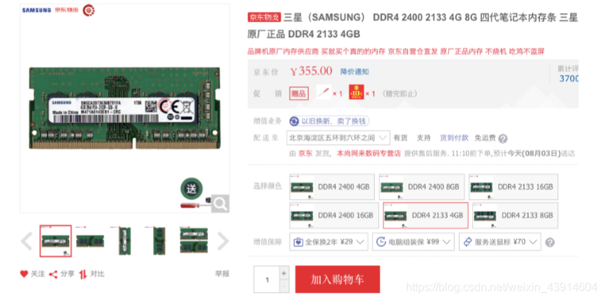

# 1. 内存管理的概念

## 1. 什么是内存？进程的基本原理，深入指令理解其过程

### 0. 思维导图

### 1. 什么是内存？有何作用？

#### （1）存储单元

https://blog.csdn.net/weixin_43914604/article/details/104099953

#### （2）几个常用数量单位&内存地址

### 2. 进程运行的基本原理
#### （1）指令的工作原理---操作码+若干参数（可能包含地址参数）

- 从X=X+1大致看一下指令的执行过程

#### （2）逻辑地址（相对地址）vs物理地址（绝对地址）

#### （3）从写程序到程序运行---编译、链接、装入

#### （4）装入模块装入内存

不修改装入模块中的指令地址就直接装入内存的话：

#### （5）装入的三种方式
##### ①绝对装入

##### ②静态重定位

##### ③ 动态重定位

#### （6）链接的三种方式
##### ① 静态链接

##### ②装入时动态链接

##### ③运行时动态链接

## 2. 内存管理管些什么？
## 3. 覆盖技术与交换技术的思想
## 4. 内存的分配与回收
## 5. 动态分区分配的四种算法（首次适应算法、最佳适应算法、最坏适应算法、临近适应算法）
## 6. 分页存储（页号、页偏移量等）
## 7. 分页存储管理的基本地址变换结构
## 8. 快表的地址变换结构
## 9. 二级页表的原理和地址结构
## 10. 基本分段存储管理（段表、地址变换、信息共享）
## 11. 段页式存储管理（段表、页表、地址转换）
