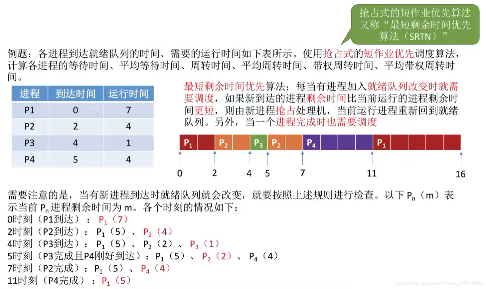

# 2. 处理机的调度

## 1. 处理机调度的概念及层次

### 0. 思维导图

### 1. 调度的基本概念

### 2. 调度的三个层次
#### （1）高级调度（ 作业调度）

#### （2）中级调度（内存调度）

#### （3）进程的挂起状态与七状态模型

#### （4）低级调度（进程调度）

#### （5）三层调度的联系和对比

## 2. 进程调度的时机（主动放弃与被动放弃）、切换与过程（广义与狭义）、方式（非剥夺与剥夺）

### 0. 思维导图、

### 1.时机
#### （1）什么时候进行进程调度？

#### （2）什么时候不能进行进程调度？

#### （3）OS内核程序临界区与普通临界区的进程调度情况

### 2. 进程调度的方式

- 所谓进程调度方式，是指当某个进程正在处理机上执行时，若有某个更为重要或紧迫的进程需要处理，即有优先权更高的进程进入就绪队列，此时应如何分配处理机。

### 3. 进程的切换和过程

## 3. 度算法的评价指标（cpu利用率、系统吞吐量、周转时间、等待时间、响应时间）

### 0. 思维导图

### 1. CPU利用率

### 2. 系统吞吐量

### 3. 周转时间

### 4. 等待时间

### 5. 响应时间

## 4. 作业/进程调度算法（FCFS先来先服务、SJF短作业优先、HRRN高响应比优先）

### 0. 思维导图

### 1. 先来先服务---FCFS（First come first sever）

### 2. 短作业优先---SJF（Shortest Job First）

- Shortest Job First

- 非抢占式—SJF

- 抢占式—SJF(SRTN)

- 注意几个细节

### 3. 高响应比优先---HRRN（Highest Response Ratio Next）

### 4. 三种算法的对比和总结

## 5. 作业/进程调度算法（时间片轮转调度算法、优先级调度算法、多级反馈队列调度算法）

### 0. 思维导图

### 1. 时间片轮转---RR（Round-Robin）

- Round-Robin

- 时间片为2举例

- 以时间片为5举例

- 可能出现的问题，比如与FCFS对比

### 2. 优先级调度算法

- 非抢占式例子

- 抢占式例子

- 补充

### 3. 多级反馈队列调度算法

- 举个例子

### 4. 三种算法的对比总结

