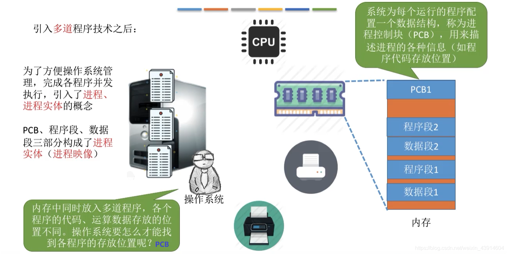
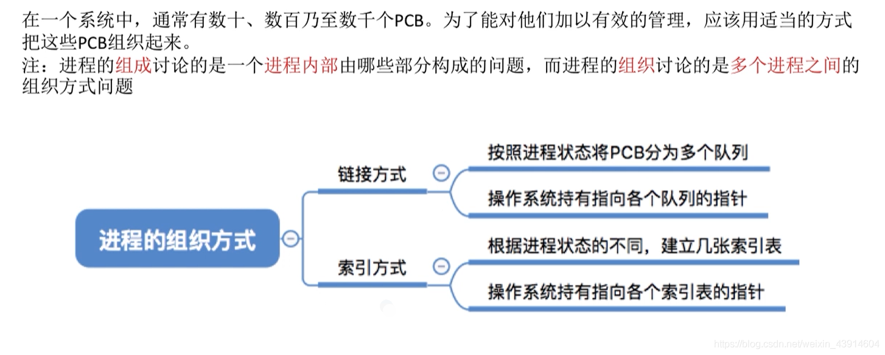
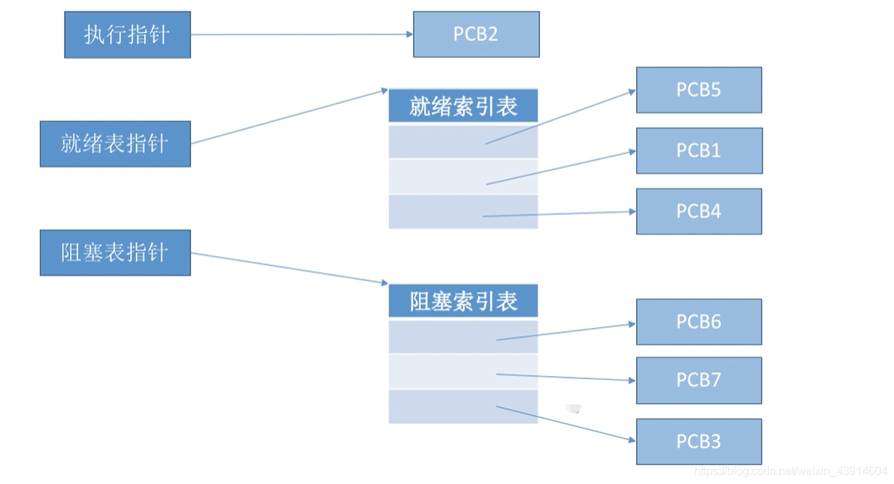

# 2. 进程管理

## 1. 进程与线程

### 1. 进程的定义、特征、组成、组织

#### 1. 进程的定义
##### （1）程序的概念

##### （2）进程的概念

- 进程和程序的区别和联系

> 区别：
> 
> 进程是动态的;程序是静态的。
> 
> 进程有独立性，能并发执行;程序不能并发执行。
> 
> 二者无一一对应关系。
> 
> 进程异步运行，会相互制约;程序不具备此特征。但是，进程与程序又有密切的联系： 进程不能脱离具体程序而虚设， 程序规定了相应进程所要完成的动作。
> 
> 组成不同。进程包含PCB、程序段、数据段。程序包含数据和指令代码。
> 
> 程序是一个包含了所有指令和数据的静态实体。本身除占用磁盘的存储空间外，并不占用系统如CPU、内存等运行资源。
> 
> 进程由程序段、数据段和PCB构成,会占用系统如CPU、内存等运行资源。
> 
> 一个程序可以启动多个进程来共同完成。

> 联系：进程不能脱离具体程序而虚设， 程序规定了相应进程所要完成的动作。

##### （3）进程的定义

#### 2. 进程的特征

#### 3. 进程的组成

- 而其中最重要的就是**进程控制块PCB**（Process Control Block）
- PCB简介：
  - PCB中记录了操作系统所需的，用于描述进程的当前情况以及控制进程运行的全部信息。
  - PCB的作用是使一个在多道程序环境下不能独立运行的程序（含数据），成为一个能独立运行的基本单位，一个能与其他进程并发执行的进程。
  - 或者说，OS是根据PCB来对并发执行的进程进行控制和管理的。
  - 例如，当OS要调度某进程执行时，要从该进程的PCB中查处其现行状态及优先级；在调度到某进程后，要根据其PCB中所保存的处理机状态信息，设置该进程恢复运行的现场，并根据其PCB中的程序和数据的内存始址，找到其程序和数据；
  - 进程在执行过程中，当需要和与之合作的进程实现同步，通信或者访问文件时，也都需要访问PCB；
  - 当进程由于某种原因而暂停执行时，又须将器断点的处理机环境保存在PCB中。
  - 可见，在进程的整个生命期中，系统总是通过PCB对进程进行控制的，即系统是根据进程的PCB而不是任何别的什么而感知到该进程的存在的。
  - 所以说，PCB是进程存在的唯一标志。

PCB通常包含的内容：

#### 4. 进程的组织

##### （1）链接方式

##### （2）索引方式

### 2. 进程的状态（运行、就绪、阻塞、创建、终止）及转换（就绪->运行、运行->就绪、运行->阻塞、阻塞->就绪）
### 3. 原语实现对进程的控制
### 4. 进程之间的通信（共享通信、消息传递、管道通信）
### 5. 线程概念与多线程模型

## 2. 处理机的调度

### 1. 处理机调度的概念及层次
### 2. 进程调度的时机（主动放弃与被动放弃）、切换与过程（广义与狭义）、方式（非剥夺与剥夺）
### 3. 度算法的评价指标（cpu利用率、系统吞吐量、周转时间、等待时间、响应时间）
### 4. 作业/进程调度算法（FCFS先来先服务、SJF短作业优先、HRRN高响应比优先）
### 5. 作业/进程调度算法（时间片轮转调度算法、优先级调度算法、多级反馈队列调度算法）

## 3. 进程的同步与互斥

### 1. 进程的同步与互斥
### 2. 实现临界区进程互斥的软件实现方法
### 3. 实现临界区进程互斥的硬件实现方法
### 4. 信号量机制（整型信号量、记录型信号量P、V）
### 5. 信号量机制实现进程的互斥、同步与前驱关系
### 6. 进程同步与互斥经典问题（生产者-消费者问题、多生产者-多消费者问题、吸烟者问题、读者-写者问题、哲学家进餐问题）
### 7. 管程和java中实现管程的机制

## 4. 死锁

### 1. 死锁详解(预防、避免、检测、解除)
