# 1. 操作系统的基本概念

## 1.1 操作系统的概念、功能和目标（系统资源的管理者、提供接口、作为扩充机器、虚拟机）

### 1.1.1 熟悉的操作系统举例

- windows
- android
- ios
- macos
- linux

### 1.1.2 操作系统的层次结构

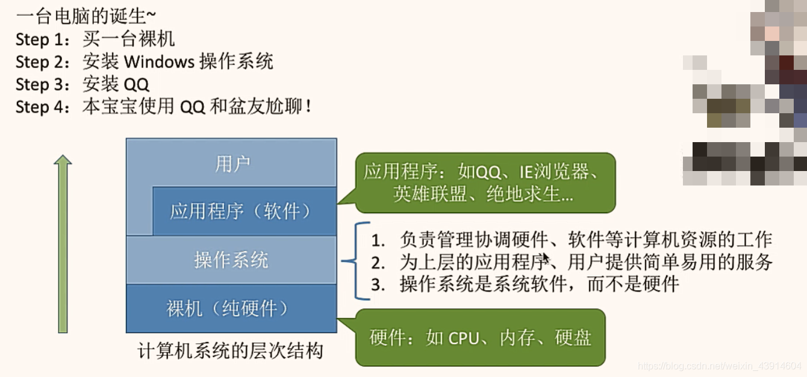

### 1.1.3 操作系统的概念

- 是系统最基本最核心的软件，属于系统软件
- 控制和管理整个计算机的硬件和软件资源
- 合理的组织、调度计算机的工作与资源的分配
- 为用户和其它软件提供方便的接口和环境

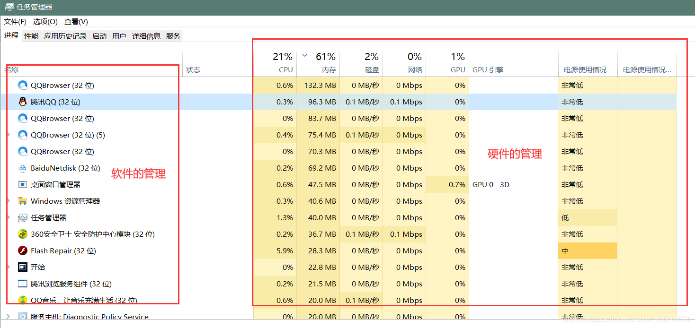

### 1.1.4 操作系统的功能和目标

- 先放一张思维导图，大致知道操作系统的具体功能和目标，然后再一一展开叙述。

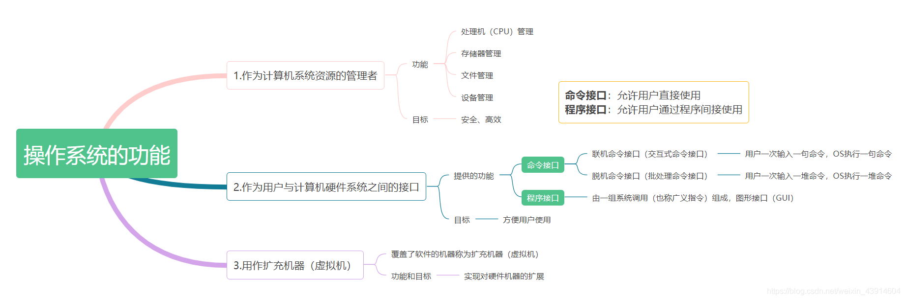

- 用一个直观的例子来理解上述图中操作系统的功能：

> - 我们假设：用户是雇主，操作系统是工人（用来操作机器），计算机是机器（由处理机(CPU)、存储器、设备、文件几个部件构成）
> - 工人有熟练的技能去控制和协调各个部件的工作，这就是**操作系统对资源的管理**
> - 同时，工人必须接受雇主的命令，这就是**“接口”**
> - 有了工人，机器就能发挥更大的作用，因此工人就成了**“扩充机器”**
> - 工人操作机器、机器有了更大的作用比如GUI界面，于是工人便成了**扩充机器**，去扩充GUI界面等功能

#### 作为计算机系统资源的管理者

- 管理软硬件资源、合理的组织、调度计算机的工作与资源的分配

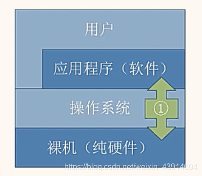

##### 处理器（CPU）管理

- 在多道程序环境下，cpu的分配和运行都以进程（或线程）为基本单位，因此对cpu的管理可理解为对进程的管理。进程管理的主要功能包括**进程控制、进程同步、进程通信、死锁处理、处理机调度**等。附上一张图理解对进程的管理。

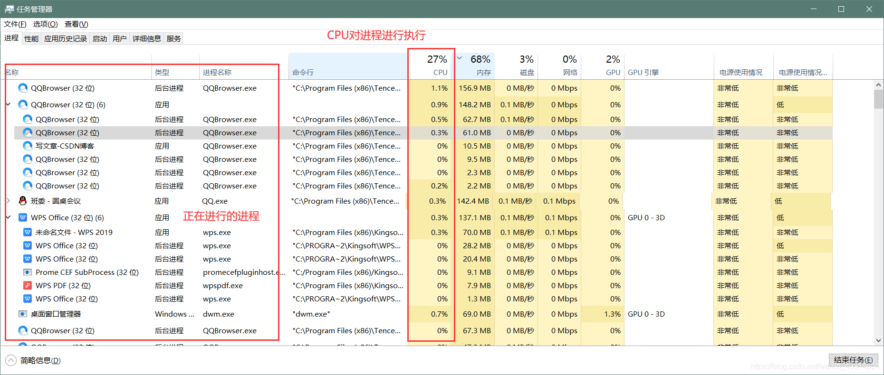

##### 存储器管理

- 为多道程序的运行提供良好的环境，方便用户使用及提高内存的利用率，主要包括**内存分配与回收、地址映射、内存保护与共享和内存扩充**等功能。

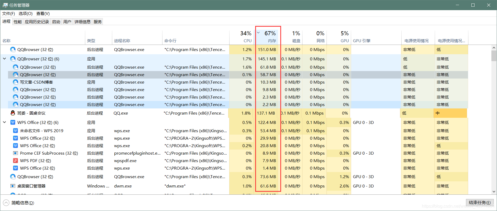

##### 文件管理

- 计算机中所有的信息都是以文件的形式存在的，操作系统中负责文件的管理的部分称为文件系统，文件管理包括**文件存储空间的管理、目录管理及文件读写管理和保护**等。

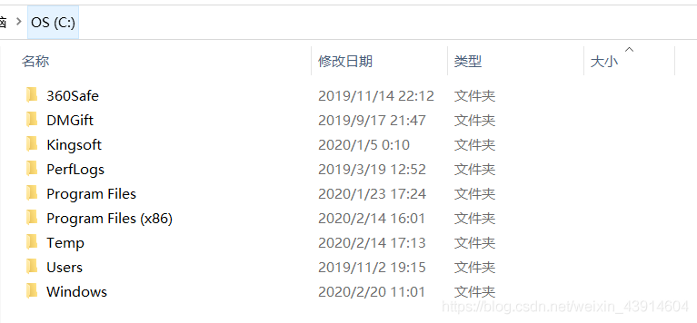

##### 设备管理

- 设备管理的主要任务是完成用户的I/O请求，方便用户使用各种设备，并提高设备的利用率，主要**包括缓存管理、设备分配、设备处理和虚拟设备**等功能。

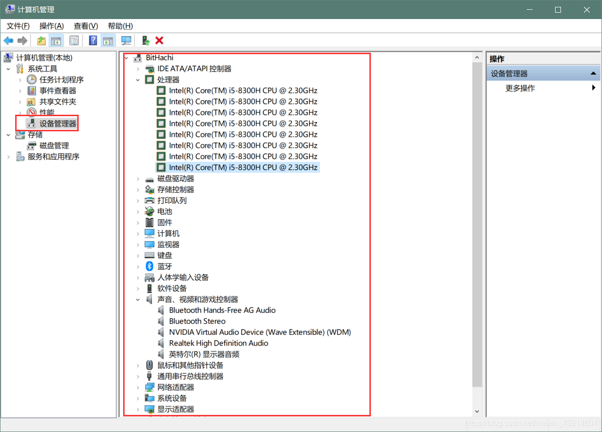

- 以上4种管理功能都由“工人”负责，“雇主”无序关注。

#### 作为用户与计算机硬件系统之间的接口

- 为了让用户方便、快捷、可靠的操作计算机硬件并执行自己的程序，操作系统提供了用户接口
- 操作系统提供的接口分为两类：**命令接口和程序接口**
- **命令接口**：用户可以**直接**使用的，利用这些操作命令来组织和控制作业的执行
- **程序接口**：用户通过程序**间接**使用的，编程人员可以使用它们来请求操作系统服务

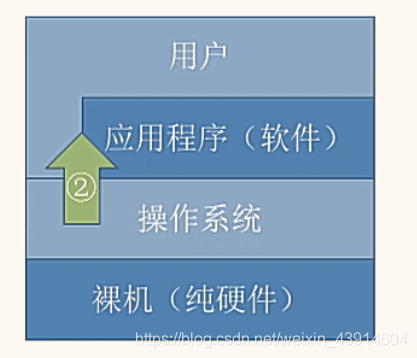

##### 命令接口

- 命令接口分为两类：联机命令接口和脱机命令接口，用户可以**直接**调用
- **联机命令接口**：又称交互式命令接口，适用于分时或实时系统的接口，由一组键盘操作命令组成。用户输入一条指令，操作系统就执行一条指令；

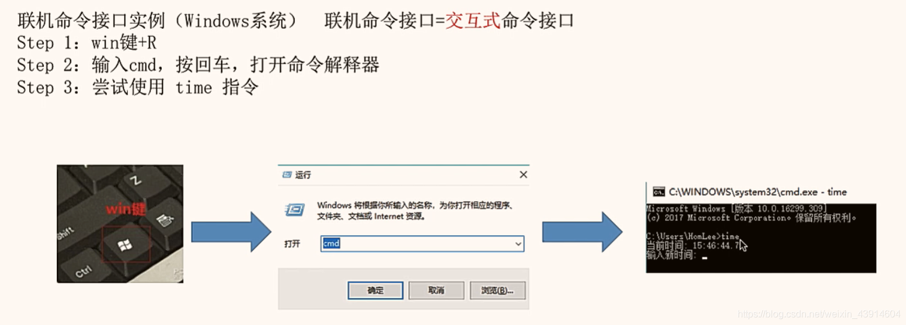

- **脱机命令接口**：又称批处理接口，使用于批处理系统，由一组作业控制命令组成。用户输入一堆指令，操作系统运行一堆指令。在操作系统运行这些命令时用户不可干预。

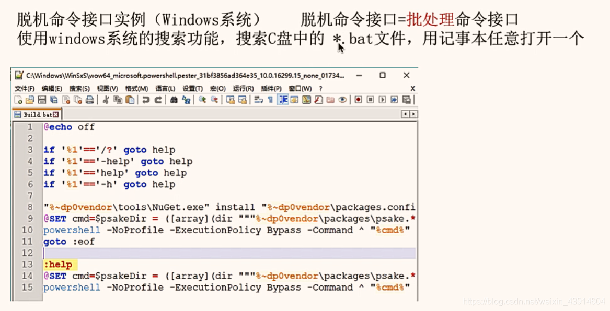

##### 程序接口

- 程序接口：由一组**系统调用（也称广义指令）**组成
- 用户通过在程序中使用这些系统调用来请求操作系统为其提供服务，只能通过用户程序**间接**调用
- 如使用各种外部设备、申请分配和回收内存及其它各种要求

> 动态链接库英文为DLL，是Dynamic Link Library的缩写。DLL是一个包含可由多个程序，同时使用的代码和数据的库。

- 比如常见的图形用户界面程序接口GUI(Graphical User Interface)

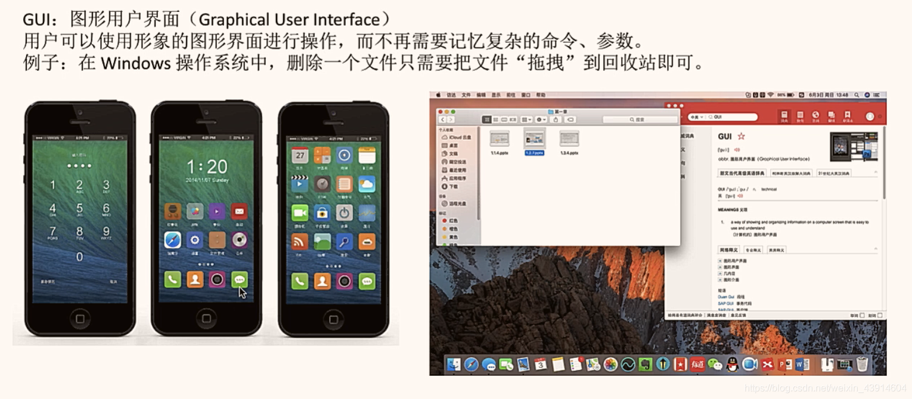

> 系统调用 = 系统调用命令 = 广义指令

#### 作为扩充机器（虚拟机）

- 没有任何软件支持的计算机称为**裸机**
- 覆盖了软件的机器称为**扩充机器或虚拟机**

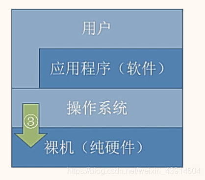
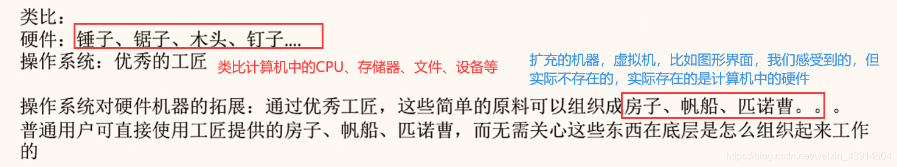

## 1.2 操作系统的特征（并发、共享、虚拟、异步）

- 操作系统是一种系统软件，但与其它系统软件和应用软件有很大的不同，它有自己的特殊性，及基本特征。

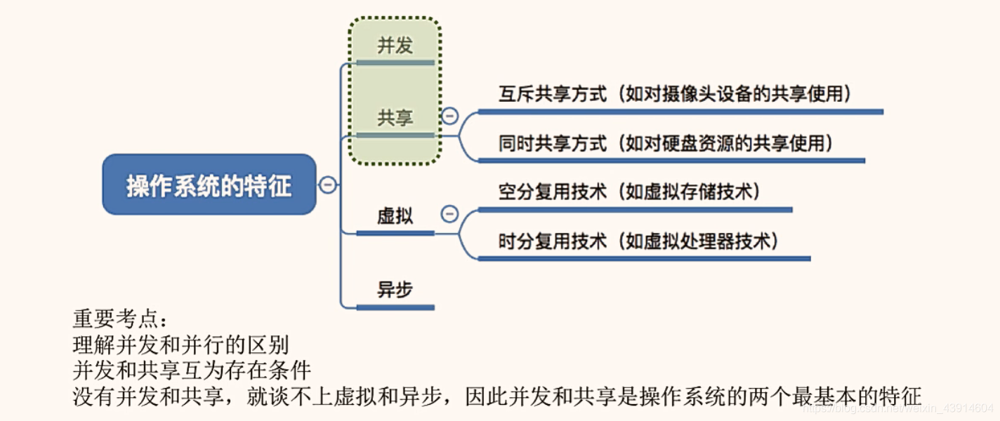

### 1. 并发

- **并发**：两个或多个事件在同一**时间间隔**内发生，这些事件在宏观上是同时发生的，在微观上是交替发生的， 操作系统的并发性指系统中同时存在着多个运行的程序
- **并行**：两个或多个事件在同一**时刻**发生
- 一个单核(CPU)同一时刻只能执行一个程序，因此操作系统会协调多个程序使他们交替进行（这些程序在宏观上是同时发生的，在微观上是交替进行的）
- 操作系统是伴随着“多道程序技术出现的”，因此操作系统和并发是一同诞生的
- 在如今的计算机中，一般都是多核cpu的，即在同一**时刻**可以并行执行多个程序，比如我的计算机是8核的，我的计算机可以在同一时刻并行执行8个程序，但是事实上我们计算机执行的程序并不止8个，因此并发技术是必须存在的，并发性必不可少。

### 2. 共享

- 资源共享即共享，是指系统中的资源可以**供内存中多个并发执行的进程**共同使用
- 共享分为两类：互斥共享和同时共享

#### 1. 互斥共享

- 计算机中的某个资源在一段时间内只能允许**一个进程**访问，别的进程没有使用权
- 临界资源(独占资源)：在一段时间内只允许一个进程访问的资源，计算机中大多数物理设备及某些软件中的栈、变量和表格都属于临界资源，它们被要求互斥共享
- 举个例子：比如QQ和微信视频。同一段时间内摄像头只能分配给其中一个进程

#### 2. 同时共享

- 计算机中的某个资源在在一段时间内可以**同时**允许多个**进程**访问
- 同时共享通常要求一个请求分为几个时间片段间隔的完成，即交替进行，“分时共享”
- 这里的**同时**指在宏观上是同时的，在微观上是交替进行访问的，只是cpu处理速度很快，我们感觉不到，在宏观上感觉是在同时进行
- 举个例子：比如QQ在发送文件A，微信在发送文件B，宏观上两个进程A和B都在访问磁盘，在我们看来是同时进行的，但是在微观上两个进程A和B是交替进行访问磁盘的，只是时间太短，cpu处理速度太快，我们感觉不到。
- **注意**：有时候多个进程可能真的是在同时进行资源访问，比如玩游戏时可以放音乐，游戏声音和音乐声音都能听见

#### 3. 并发性和共享性互为存在条件

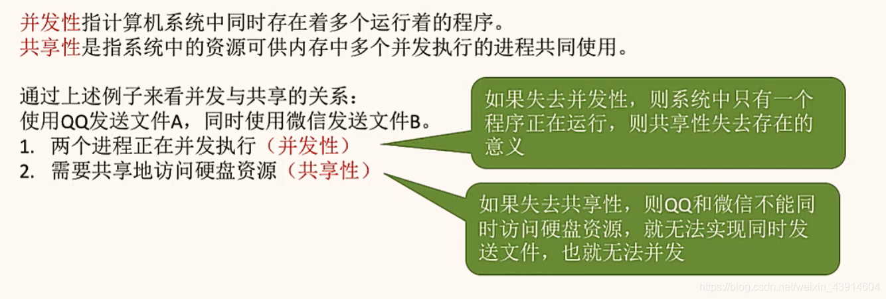

### 3. 虚拟

> 多道程序设计：是指在计算机内存中同时存放几道相互独立的程序，使它们在管理程序控制之下，相互穿插的运行。 两个或两个以上程序在计算机系统中同处于开始到结束之间的状态。这就称为多道程序设计。多道程序技术运行的特征：多道、宏观上并行、微观上串行。

- 虚拟是把一个物理上的实体变为若干逻辑上的对应物。
- 物理实体（前者）是实际存在的；而后者是虚的，是用户感觉上的事务
- 虚拟技术：用于实现虚拟的技术
- 虚拟处理器（CPU）：通过多道程序设计技术，采用让多道程序并发执行的方法，分时来使用一个CPU，实际物理上只有一个CPU，但是用户感觉到有多个CPU
- 虚拟存储器：从逻辑上扩充存储器容量，用户感觉到的但实际不存在的存储器
- 虚拟设备：将一台物理设备虚拟为逻辑上的多台设备，使多个用户在同一时间段内访问同一台设备，即同时共享，用户宏观上感觉是同时的，但实际上是微观交替访问同一台设备的
- 操作系统的虚拟技术科归纳为：
    - 时分复用技术：如处理器的分时共享
    - 空间复用技术：如虚拟存储器

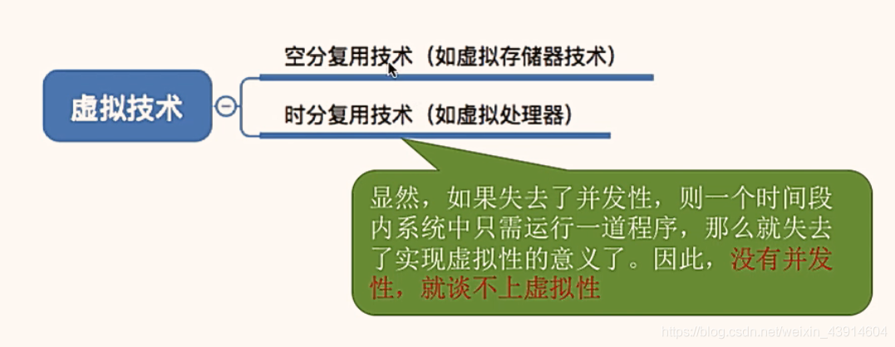

### 4. 异步

- 异步：多道程序环境允许多个程序**并发**执行，但由于资源有限，如cpu只有一个，进程的执行并不是一贯到底的，而是走走停停的，它以不可预知的速度向前推进。
- 比如A进程正在占用CPU计算，B进程这时也想占用CPU计算，B进程只有等，等A进程算完了，A进程去访问磁盘资源了，这时B进程再占用CPU进行计算，B进程还没计算完，A进程从磁盘取出资源了，A进程发现B这时在占用CPU，这时A进程就需要等待，等B算完后再继续到CPU中进行计算。由于每个进程占用资源的时间不固定，所以进程的执行以不可预知的速度前进
