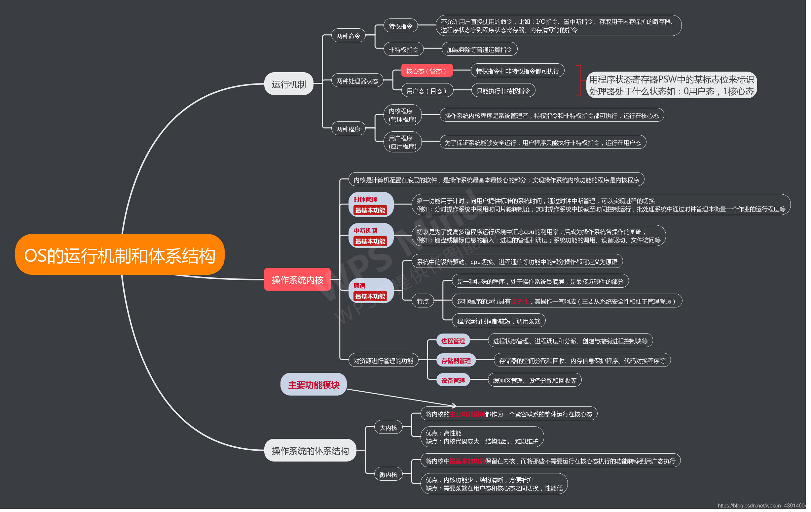
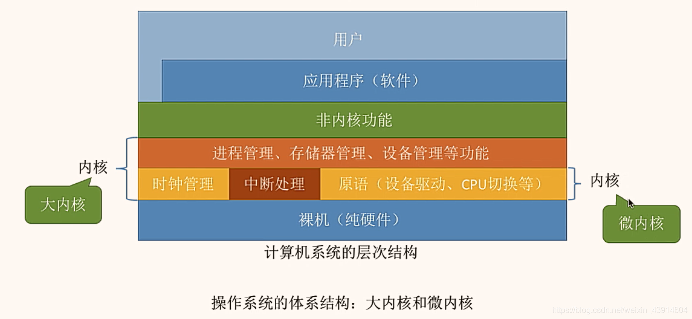
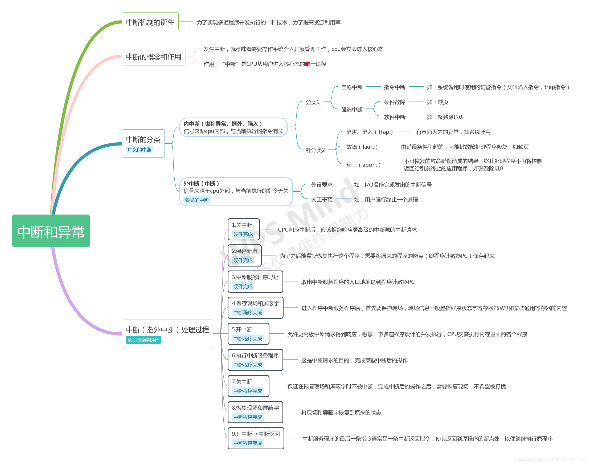
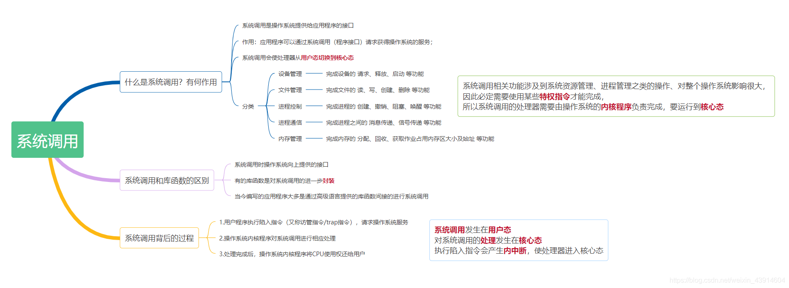
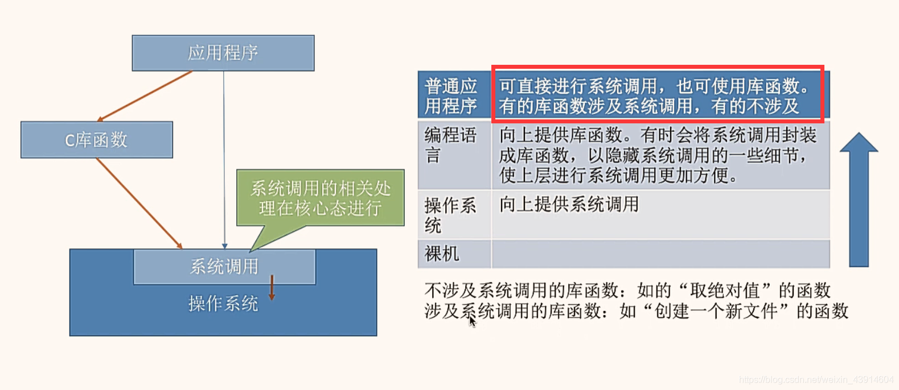
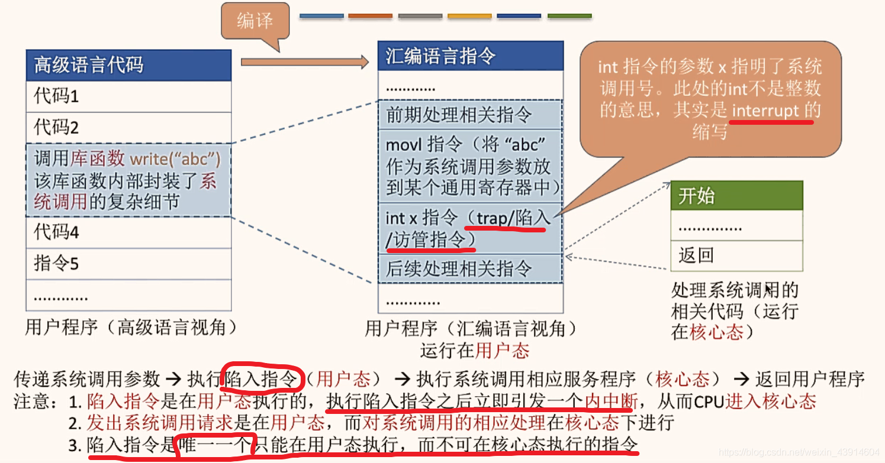

# 3. 操作系统的运行机制和体系结构

## 3.1 操作系统的运行机制和体系结构（大内核、小内核）

### 1. 操作系统的运行机制和体系结构

### 2. 操作系统内核在计算机系统中的层次结构

### 3. 操作系统体系结构类比

### 4. 操作系统用户态和核心态的转换

## 3.2 中断和异常（内中断和外中断、中断处理过程）

## 3.3 系统调用（执行过程、访管指令、库函数与系统调用）

### 1. 系统调用知识框架图

### 2. 系统调用和库函数的区别

### 3. 系统调用的执行过程

