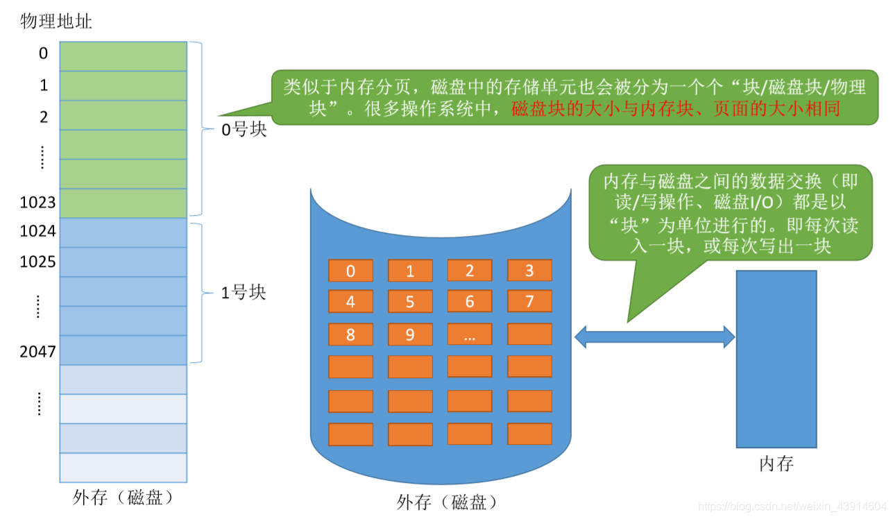
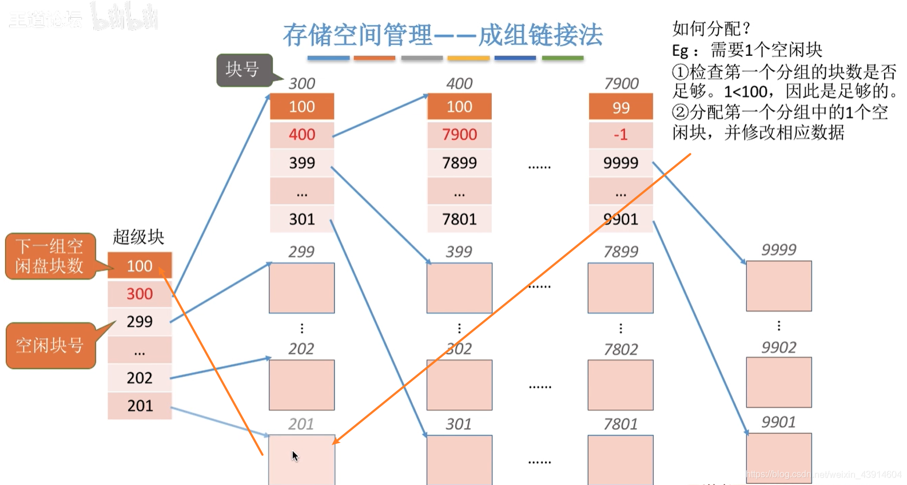

# 1. 文件系统

## 1. 初识文件管理概念和功能

### 0. 思维导图

### 1. 文件的属性

### 2. 文件内部的数据如何组织起来？

### 3. 文件之间应该如何组织起来？

### 4. 操作系统应该向上提供哪些功能？

### 5. 从上往下看，文件应该如何存放在外存？

### 6. 其他需要由操作系统实现的文件管理功能

## 2. 文件逻辑结构（顺序文件、索引文件、索引顺序文件、多级索引顺序文件）关于数据库的索引如聚簇索引可以看一下索引文件例题的解析，感觉还是可以收获到东西的

### 0. 思维导图

### 1. 无结构文件

### 2. 有结构文件

定长记录：

不定长记录：

#### 有结构文件的逻辑结构

#### 顺序文件

#### 索引文件

- 不经意间让我想起了数据库的索引，聚簇索引和唯一索引等，有了更进一步的理解，而且知道了它的时间空间效率。

#### 索引顺序文件

索引顺序文件的效率分析：

#### 多级索引顺序文件

## 3. 文件目录结构（单级-两级-多级-无环图）、索引节点FCB瘦身

### 0. 思维导图

### 1.文件控制块

#### 对目录的操作

### 2. 单级目录结构

### 3. 两级目录结构

### 4. 多级目录结构(树形目录结构)

### 5. 无环图目录结构

### 6. 索引节点(FCB的改进)瘦身

## 4. 文件的物理结构(连续分配、链接分配[隐式-显式]、索引分配[链接方案-多层索引-混合索引])

### 0. 思维导图

### 1.文件块、磁盘块

### 2.连续分配

连续分配优点：

连续分配缺点：

### 3.链接分配

#### 隐式链接

#### 显式链接

#### 链接分配总结

### 4.索引分配

如何实现逻辑块号到物理块号的转换？

数据太大，一个索引表装不下那么多的映射怎么办？

#### 链接方案

#### 多层索引

#### 混合索引

#### 索引分配总结

### 5. 文件物理结构分配总结

## 5. 文件管理空闲磁盘块的几种算法(空闲表法、空闲链表法、位示图法、成组链接法)

### 0. 思维导图

### 1. 存储空间的划分与初始化

### 2. 空闲表法

如何分配？

如何回收？

### 3. 空闲链表法

#### 空闲盘块链

#### 空闲盘区链

### 4. 位示图法

如何分配与回收？

### 5. 成组链接法

超级块的作用

如何分配？

需要1个空闲磁盘块

需要100个空心啊磁盘块

如何回收？

第二种情况，第一组已满

## 6. 文件的基本操作原理(创建、删除、打开、关闭、读-写)

### 0. 思维导图

### 1. 创建文件

### 2. 删除文件

### 3. 打开文件

打开文件表有两种：

### 4. 关闭文件

### 5. 读文件

### 6. 写文件

## 7. 文件共享（索引节点-硬链接、符号链接-软链接）

### 0. 思维导图

### 1. 基于索引结点的共享方式（硬链接）

### 2. 基于符号链的共享方式（软链接）

例子

共享的文件不存在时

## 8. 文件保护（口令保护、加密保护、访问控制）

### 0. 思维导图

### 1. 口令保护

### 2. 加密保护

### 3. 访问控制

#### windows的访问控制

## 9. 文件系统的层次结构

### 0. 知识总览

### 1. 举个例子

