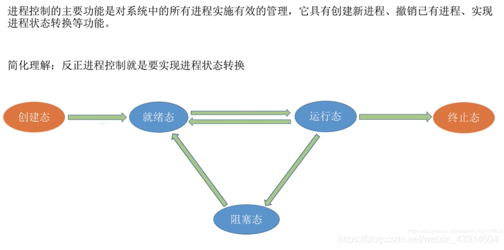
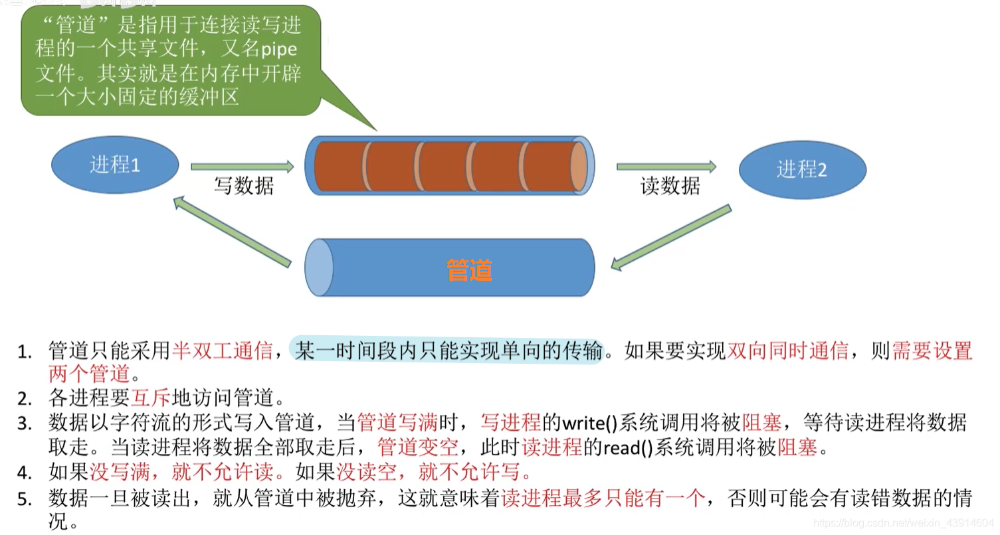
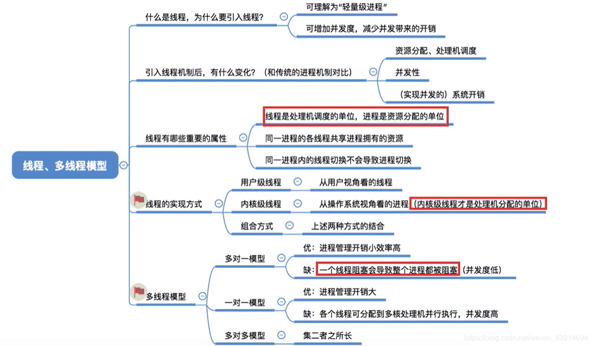

# 1. 进程与线程

## 1. 进程的定义、特征、组成、组织

### 1. 进程的定义
#### （1）程序的概念

#### （2）进程的概念

- 进程和程序的区别和联系

> 区别：
>
> 进程是动态的;程序是静态的。
>
> 进程有独立性，能并发执行;程序不能并发执行。
>
> 二者无一一对应关系。
>
> 进程异步运行，会相互制约;程序不具备此特征。但是，进程与程序又有密切的联系： 进程不能脱离具体程序而虚设， 程序规定了相应进程所要完成的动作。
>
> 组成不同。进程包含PCB、程序段、数据段。程序包含数据和指令代码。
>
> 程序是一个包含了所有指令和数据的静态实体。本身除占用磁盘的存储空间外，并不占用系统如CPU、内存等运行资源。
>
> 进程由程序段、数据段和PCB构成,会占用系统如CPU、内存等运行资源。
>
> 一个程序可以启动多个进程来共同完成。

> 联系：进程不能脱离具体程序而虚设， 程序规定了相应进程所要完成的动作。

#### （3）进程的定义

### 2. 进程的特征

### 3. 进程的组成

- 而其中最重要的就是**进程控制块PCB**（Process Control Block）
- PCB简介：
    - PCB中记录了操作系统所需的，用于描述进程的当前情况以及控制进程运行的全部信息。
    - PCB的作用是使一个在多道程序环境下不能独立运行的程序（含数据），成为一个能独立运行的基本单位，一个能与其他进程并发执行的进程。
    - 或者说，OS是根据PCB来对并发执行的进程进行控制和管理的。
    - 例如，当OS要调度某进程执行时，要从该进程的PCB中查处其现行状态及优先级；在调度到某进程后，要根据其PCB中所保存的处理机状态信息，设置该进程恢复运行的现场，并根据其PCB中的程序和数据的内存始址，找到其程序和数据；
    - 进程在执行过程中，当需要和与之合作的进程实现同步，通信或者访问文件时，也都需要访问PCB；
    - 当进程由于某种原因而暂停执行时，又须将器断点的处理机环境保存在PCB中。
    - 可见，在进程的整个生命期中，系统总是通过PCB对进程进行控制的，即系统是根据进程的PCB而不是任何别的什么而感知到该进程的存在的。
    - 所以说，PCB是进程存在的唯一标志。

PCB通常包含的内容：

### 4. 进程的组织

#### （1）链接方式

#### （2）索引方式

## 2. 进程的状态（运行、就绪、阻塞、创建、终止）及转换（就绪->运行、运行->就绪、运行->阻塞、阻塞->就绪）

### 1. 思维导图总览

### 2. 进程的状态
#### （1）三种基本状态（就绪、运行、阻塞）

#### （2）创建态和结束态

- 创建态

- 结束态

### 3.进程状态之间的转换

- 进程一共有如下5种状态，那么他们之间如何实现切换呢？

- 咱们从一个进程的从无到有看起，来了解进程5种状态之间的转换

- 来一张形象生动的图片感受一下5种状态之间的切换

## 3. 原语实现对进程的控制

### 0. 思维导图

### 1. 什么是进程控制？

### 2. 原语实现对进程的控制

- 关于原语的作用和处在操作系统内核的重要地位可参考：https://blog.csdn.net/weixin_43914604/article/details/104452762

### 3. 回忆进程的组织

- 进程在操作系统中的组织使各个进程能够有序的进行切换和运行

### 4. 进程控制大致图解

> 这里说明一下调度和切换的区别：
>
> **调度**是指决定资源分配给哪个进程的行为，是一种决策行为
>
> **切换**是指实际分配的行为，是执行行为
>
> 一般来说现有资源调度，后有进程切换

### 5. 进程控制原语的相同点

- 接下来我们就具体学习一下关于进程控制的五种原语，**进程的创建、终止、唤醒、阻塞、切换**；

### 6. 进程控制的五种原语

（1）进程的创建原语

（2）进程的终止原语

（3）进程的唤醒和阻塞原语

- 进程的阻塞和唤醒原语是**成对存在**的，必须成对使用。

- **阻塞原语**是由被阻塞进程自我调用实现的

- **唤醒原语**是由一个被唤醒进程合作或被其他相关的进程调用实现的

（4）进程的切换原语

## 4. 进程之间的通信（共享通信、消息传递、管道通信）

### 0.思维导图

### 1.什么是进程通信？

- 图中我们可以知道什么是进程通信，以及进程通信的低级和高级方式；
- 我们还可以知道为什么要引入进程通信方式，以及它的意义

### 2.共享存储

- 共享一块大家都可以访问的空间，一次只能有一个进程进行读或写操作

### 3.管道通信

### 4.消息传递

- 发送信息的进程将消息头写好，接受信息进程根据消息头读取信息或寻找信封是哪一个

## 5. 线程概念与多线程模型

### 0.思维导图

### 1.为什么要引入线程？

- 为了方便于理解，我打开了我的任务管理器，可以看出chrome一个进程，下面有很多分支，可以把这些分支当做线程看待，PID即进程和线程都有的标识符。

### 2.什么是线程？

### 3.引入线程带来的变化及进程与线程的比较

### 4.线程的属性

### 5.线程的实现方式

- 前面我们了解了引入线程的好处和引入线程的变化，以及线程的属性，那么线程如何实现呢？
- 线程的实现分为两类：**用户级线程**(User-Level Thread,UTL)和**内核级线程**(Kernel-Level Thread, KTL)l。内核级线程又称**内核支持的线程**。

#### （1）用户级线程

#### （2）内核级线程

#### （3）特殊的组合方式及重点注意

### 6.多线程模型

- 前面我们提到了线程的实现方式，有用户级和内核级。那么这两种模式的交叉组合就会产生几种不一样的组织结构，即不一样的模型。

#### （1）多对一模型

#### （2）一对一模型

#### （3）多对多模型

- 此种模型**效率**是三种模型中最好的

