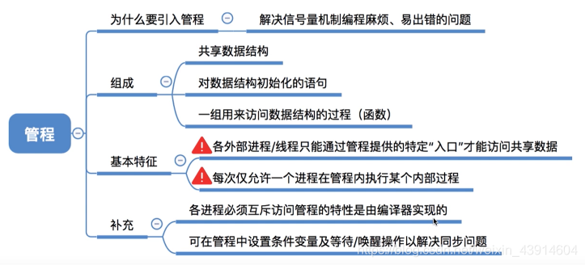

# 3. 进程的同步与互斥

## 1. 进程的同步与互斥

### 0. 思维导图

### 1. 进程同步

- **同步也称为直接制约关系。**
- 在多道程序环境下，进程是并发执行的，不同进程之间存在着不同的相互制约关系。为了协调进程之间的相互制约关系,如等待、传递信息等，引入了进程同步的概念。进程同步是为了解决进程的异步问题。
- 一个简单的例子来理解这个概念。
- 例如，让系统计算1 + 2x3，假设系统产生两个进程: 一个是加法进程，一个是乘法进程。要让计算结果是正确的，一定要让加法进程发生在乘法进程之后,但实际上操作系统具有**异步性**,若不加以制约，加法进程发生在乘法进程之前是绝对有可能的，因此要制定一定的机制去约束加法进程，让它在乘法进程完成之后才发生。

> 异步性：进程具有异步性的特征。异步性是指，各并发执行的进程以各自独立的、不可预知的速度向前推进。

### 2. 进程互斥

- **互斥，亦称间接制约关系**。**进程互斥**指当一个进程访问某临界资源时，另一个想要访问该临界资源的进程必须等待。当前访问**临界资源**的进程访问结束，释放该资源之后，另一个进程才能去访问临界资源。
- 在这里需复习一下**临界资源**的概念。
- 我们把一个时间段内只允许一个进程使用的资源称为临界资源。许多物理设备(比如摄像头、打印机)都属于临界资源。此外还有许多变量、数据、内存缓冲区等都属于临界资源。
- 对临界资源的访问，必须互斥地进行。
  

- 为了禁止两个进程同时进入**临界区**，需遵循以下准则

## 2. 实现临界区进程互斥的软件实现方法

### 0. 思维导图

- 软件实现方法的思想：在进入区设置并检查一些标志 来标明是否有进程在临界区中,若已有进程在临界区，则在进入区通过循环检查进行等待，进程离开临界区后则在退出区修改标志。**入区通过循环检查进行等待，进程离开临界区后则在退出区修改标志**。

### 1. 单标志法

### 2. 双标志先检查法

### 3. 双标志后检查法

### 4. Peterson算法

## 3. 实现临界区进程互斥的硬件实现方法

### 0. 思维导图

### 1. 中断隐藏方法

### 2. TestAndSet指令

- 执行TSL指令时，它的内部运转逻辑：
- 假设lock现在为false，代表临界资源A空闲，那么我就可以访问这个资源，同时将lock=true，提醒别的进程，这个临界资源A我正在使用，让他们等等
- 假设lock为true，代表临界资源正在有人使用，所以我必须等待，并且将lock=true，并不影响什么，所以没关系，只是为了让lock为false时可以上锁，将上锁与检查在一个TSL指令完成。
  

### 3. Swap指令

- old是每个进程都要进行的一步，都必须将old=true
- 分析一下这样做的原因：
- 因为lock是某一特定临界资源的共享变量，当每一个进程准备访问这个特定的临界资源时，初始化old=true，然后进入while循环进行交换，如果当前lock是false,则交换后old=false,则当前进程可以跳出循环进入临界区代码段，同时因为交换，lock=old=true上锁，不让别的进程来打扰，别的进程会因为lock变为true,一直在while循环等待,当我使用完临界资源，则将lock=false,此时别的进程再交换old和lock就能判断old=false,可以跳出循环，使用临界资源。

## 4. 信号量机制（整型信号量、记录型信号量P、V）

### 0. 思维导图

### 1. 为什么引入信号量机制？

- 为了更好的解决进程互斥与同步的问题

### 2. 什么是信号量机制？

### 3. 整型信号量

### 4. 记录型信号量

#### （1）举一个生动形象的例子了解记录型信号量

- 一张图咱们回忆一下进程的状态

- 一个例子

#### （2）梳理一下记录型信号量的知识点（P、V）

## 5. 信号量机制实现进程的互斥、同步与前驱关系

### 0. 思维导图

### 1. 信号量机制实现进程互斥

### 2. 信号量机制实现进程同步

- 想象一下四则运算的顺序，加减乘除；

- 要想理解这一部分知识，必须知道P、V操作的内部实现原理

### 3. 信号量机制实现前驱关系

## 6. 进程同步与互斥经典问题（生产者-消费者问题、多生产者-多消费者问题、吸烟者问题、读者-写者问题、哲学家进餐问题）

### 0. 前言

- 同步时，前V后P。
  

### 1. 生产者-消费者问题
#### （1）问题描述

- 系统中有**一组生产者进程**和**一组消费者进程**，生产者进程每次**生产一个**产品放入缓冲区，消费者进程每次从缓冲区中取出一个产品并使用。(注: 这里的“产品”理解为某种数据)
- 生产者、消费者**共享**一个初始为空、大小为n的**缓冲区**。
- 只有缓冲区**没满**时，**生产者**才能把产品**放入**缓冲区，否则必须等待。
- 只有缓冲区**不空**时，**消费者**才能从中**取出**产品，否则必须等待。
- 缓冲区是临界资源，各进程必须**互斥**地访问。

  

#### （2）问题分析

- 1)关系分析。生产者和消费者对缓冲区互斥访问是**互斥关系**，同时生产者和消费者又是一个相互协作的关系，只有生产者生产之后,消费者才能消费，它们也是**同步关系**。
- 2)整理思路。根据各进程的操作流程确定P、V操作的大致顺序。
  - 生产者每次要消耗(P）一个空闲缓冲区，并生产(V)一个产品。
  - 消费者每次要消耗(P）一个产品，并释放一个空闲缓冲区(V)。
  - 往缓冲区放入/取走产品需要互斥。
- 3)信号量设置。设置信号量。设置需要的信号量，并根据题目条件确定信号量初值。( 互斥信号量初值一般为1，同步信号量的初始值要看对应资源的初始值是多少)

#### （3）如何实现？

#### （4）实现互斥的P操作一定要在实现同步的P操作之后

#### （5）知识回顾与重要考点

### 2.多生产者-多消费者问题
#### （1）问题描述

#### （2）问题分析

#### （3）实现方法
##### ① 有mutex

##### ② 无mutex

##### ③ 为什么有mutex和没有mutex一样呢？

- 原因在于:本题中的缓冲区大小为1，在任何时刻，apple、 orange、 plate 三个同步信号量中最多只有一个是1。因此在任何时刻，最多只有一个进程的P操作不会被阻塞，并顺利地进入临界区…

##### ④ 如果有两个盘子plate

#### （4）知识总结与重要考点

- 总结:在生产者_消费者问题中，如果缓冲区大小为1，那么有可能不需要设置互斥信号量就可以实现互斥访问缓冲区的功能。当然，**这不是绝对的**，要具体问题具体分析。
- 建议:在考试中如果来不及仔细分析，可以加上互斥信号量，保证各进程一定会互斥地访问缓冲区。但需要注意的是，**·实现互斥的P操作一定要在实现同步的P操作之后·**，否则可能引起·**“死锁”**·。

### 3. 读者-写者问题
#### （1）问题描述

#### （2）问题分析

#### （3）实现方法
##### ① 给count加mutex互斥访问

- 这里说一下为什么要加mutex。
- 比如：当count=0时，第一个读者进程执行到p(rw),rw=0,假设此时时间片到了，切换到第二个读者进程,第二个进程发现count=0,则执行p(rw)，但是此时rw=0，于是第二个进程被堵在p（rw）这里，同理，后面的可能会有多个进程堵在p(rw)，只有当第一个进程再次获得时间片，执行count++,让count不为0，然后其他进程就可以直接绕过if直接进行count++来访问文件，但是第三个读者进程和后面的几个可能堵在p(rw)的多个读者进程则必须得等count–为0后才可以再次和写进程竞争来访问文件，对count的访问没有做到一气呵成，会导致本来一些进程一直堵在p（rw）。

##### ② 加一个w实现“读写公平法”

- 在上面的算法中，读进程是优先的，即当存在读进程时，写操作将被延迟，且只要有 一个读进程活跃，随后而来的读进程都将被允许访问文件。这样的方式会导致写进程可能长时间等待，且存在写进程“饿死”的情况。
- 若希望写进程优先，即当有读进程正在读共享文件时，有写进程请求访问，这时应禁止后续读进程的请求，等到已在共享文件的读进程执行完毕，立即让写进程执行，只有在无写进程执行的情况下才允许读进程再次运行。为此，增加一个信号量并在上面程序的writer()和 reader()函数中各增加一对PV操作，就可以得到写进程优先的解决程序。

#### （4）知识回顾与重要考点

### 4. 吸烟者问题
#### （1）问题描述

#### （2）问题分析

#### （3）实现方法

#### （4）知识回顾与重要考点

### 5. 哲学家进餐问题
#### （1）问题描述

#### （2）问题分析

#### （3）如何实现

#### （4）知识回顾与重要考点

## 7. 管程和java中实现管程的机制

### 0. 思维导图

### 1. 为什么引入管程？

### 2. 管程的组成及基本特征

### 3. 管程实现生产者消费者问题

### 4. java中类似于管程的机制

