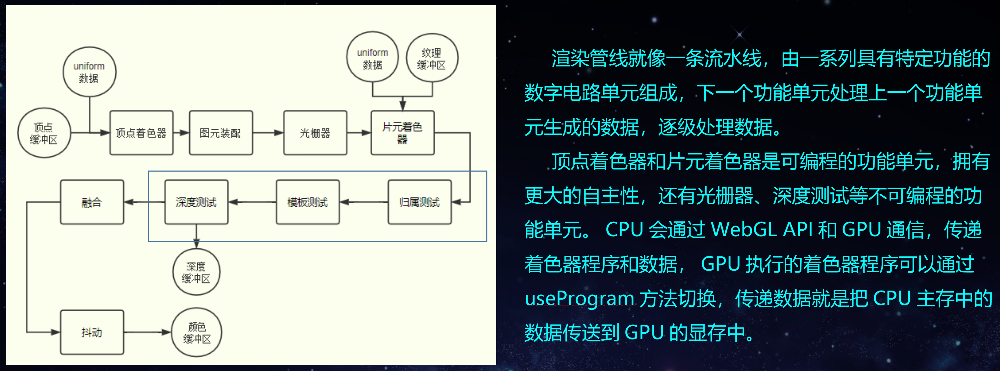
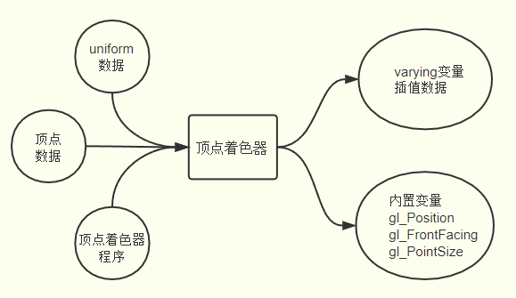
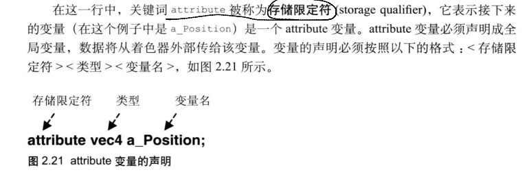
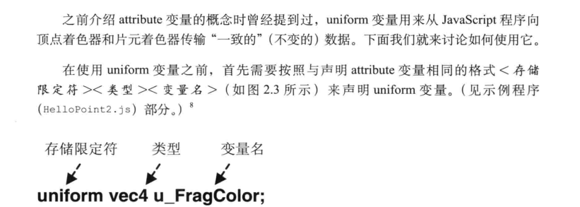
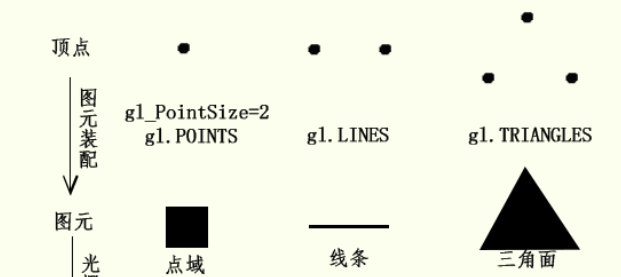
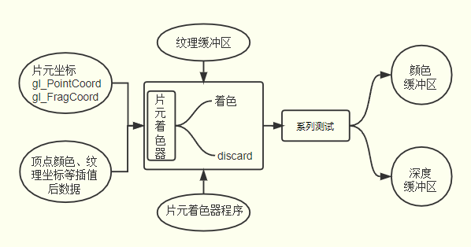

# webgl

## webgl容器（坐标系）

正交右手坐标系，且每个方向都有可以使用的值的区间，超出该矩形区间的图像不会绘制

- x轴左边为-1，右边为1
- y轴下边为-1，上边为1
- z轴朝你的方向最大值为1，原理你的方向最大值为-1

无论canvas标签容器多少px，webgl区间是一致的。

## webgl渲染管线

## webgl关键名词

### 顶点着色器

顶点着色器是GPU渲染管线上一个可以执行着色器语言的功能**单元**，具体执行的就是顶点着色器程序，WebGL顶点着色器程序在Javascript中以**字符串**的形式存在，通过编译处理后传递给顶点着色器执行。

顶点着色器主要作用就是执行顶点着色器程序对顶点进行变换计算，比如顶点位置坐标执行进行旋转、平移等矩阵变换，变换后新的顶点坐标然后赋值给内置变量gl_Position，作为顶点着色器的输出，图元装配和光栅化环节的输入。

- attribute

- uniform

### 图元装配

顶点变换后的操作是图元装配(primitive assembly)，硬件上具体是怎么回事不用思考，从程序的角度来看，就是绘制函数drawArrays()或drawElements()第一个参数绘制模式mode控制顶点如何装配为图元， gl.LINES的定义的是把两个顶点装配成一个线条图元，gl.TRIANGLES定义的是三个顶点装配为一个三角面图元，gl.POINTS定义的是一个点域图元。

### 光栅化

片元着色器和顶点着色器一样是GPU渲染管线上一个可以执行着色器程序的功能**单元**，顶点着色器处理的是逐顶点处理顶点数据，片元着色器是逐片元处理片元数据。通过给内置变量gl_FragColor赋值可以给每一个片元进行着色， 值可以是一个确定的RGBA值，可以是一个和片元位置相关的值，也可以是插值后的顶点颜色。

除了给片元进行着色之外，通过关键字discard还可以实现哪些片元可以被丢弃，被丢弃的片元不会出现在帧缓冲区，自然不会显示在canvas画布上。

精度丢失问题

文字问题

pbr材质

