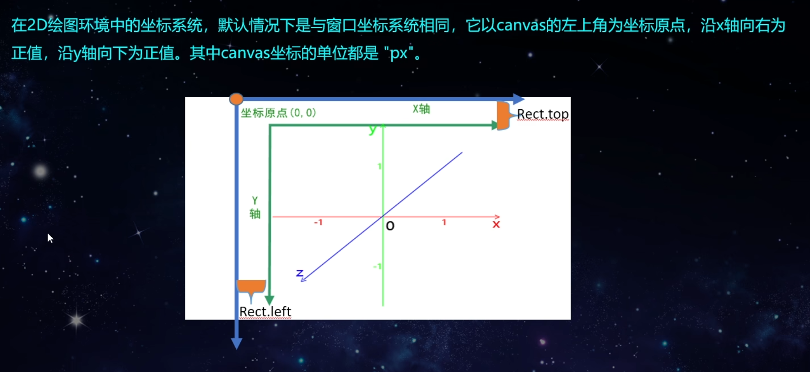

# webgl

## 渲染流程管线

webgl容器坐标系

正交右手坐标系，且每个方向都有可以使用的值的区间，超出该矩形区间的图像不会绘制

- x轴左边为-1，右边为1
- y轴下边为-1，上边为1
- z轴朝你的方向最大值为1，原理你的方向最大值为-1

无论canvas标签容器多少px，webgl区间是一致的。

webgl渲染管线

webgl关键名词

精度丢失问题

文字问题

pbr材质

